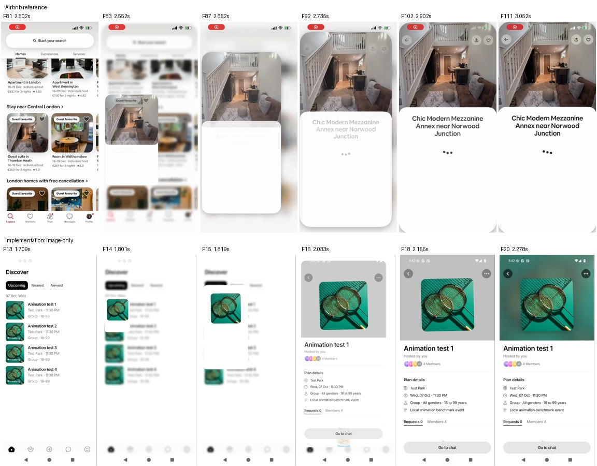
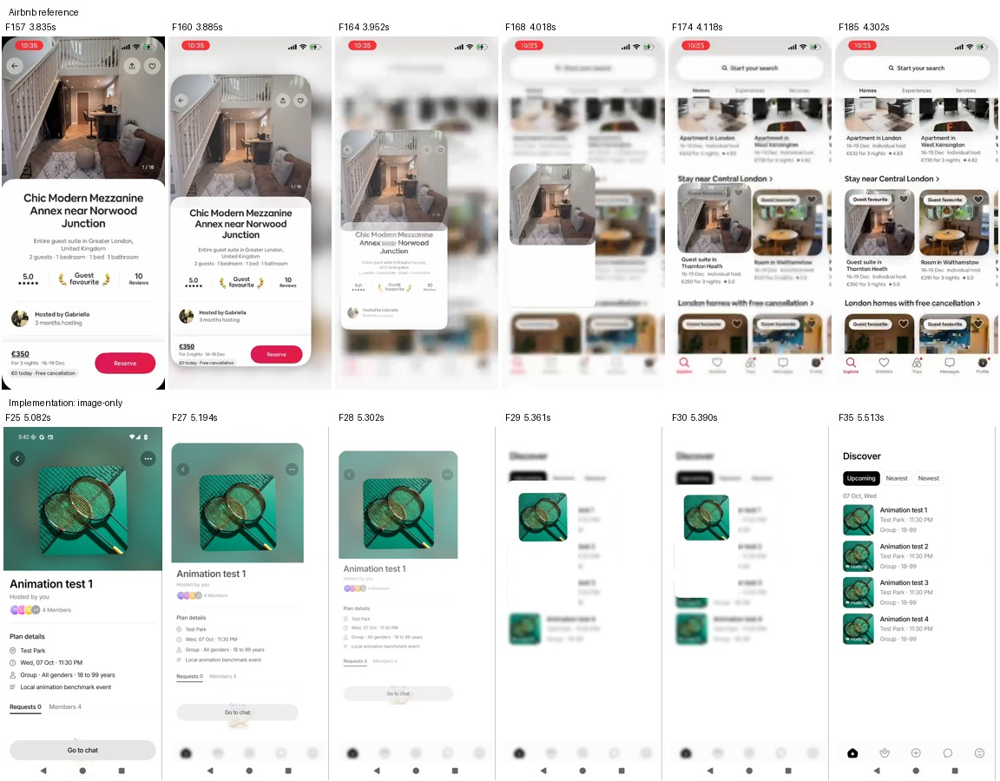
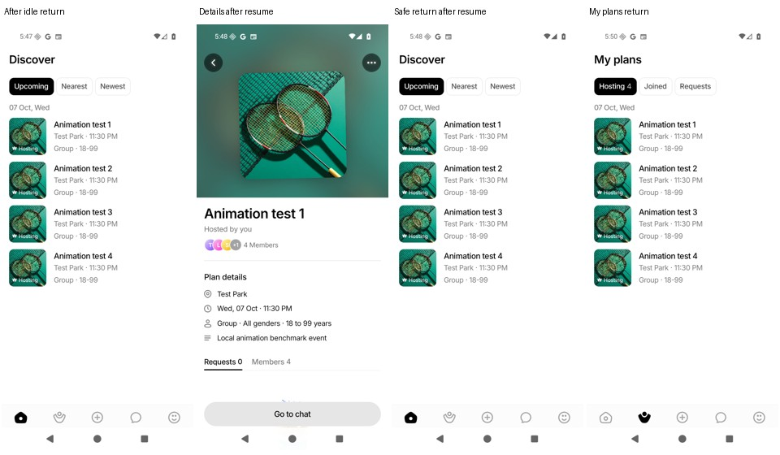

# Image-only expanding event transition

Phone acceptance: after the return-flicker repair was installed, the user confirmed the implementation works correctly and requested commit/push. This is visual acceptance on their Galaxy A56, not a new instrumented performance result.

Follow-up: [return-endpoint flicker repair and frame comparison](return-flicker-report.md). This corrects the flash missed in the original visual review; broader frame-time results below are unchanged.

Date: 7 September 2026. **Image-only design implemented and visually tested; performance acceptance remains open.**

The image and rounded page now expand together and return to the source card. There is no shared-text animation. The final release passed the recorded navigation/lifecycle checks, but its emulator opening/return p95 values (**145.3 / 108.7 ms**) remain worse than the previous design (**70.6 / 83.4 ms**).

## Implementation plan

1. Match the reference's motion structure first: rounded page expansion with the image, then contraction to the originating image. Keep the existing Event Details resting layout and splash.
2. Remove shared text. Titles and other content appear inside the page, without a separate moving text replica or a title-measurement delay.
3. Use one progress value for the page and image. Keep the bitmap at a fixed layout size; use UI-thread transforms for travel and scaling. Keep source measurement, image readiness, cancellation, and reduced-motion fallbacks.
4. Intercept back navigation for a reverse transition, remeasure both endpoints, and navigate once contraction completes. If either endpoint disappears or is offscreen, use the normal close fallback.
5. Record the release implementation and compare its original frames with the supplied Airbnb recording. Adjust visible mismatches, and explicitly record remaining differences.
6. Measure the previous and new release versions on the same emulator: one warm-up plus ten opening/closing trials, Perfetto FrameTimeline, screenshots after every step. Keep recording separate from performance capture. Also check long-open and background/resume behavior.
7. Report measured changes, regressions, test results, and visual evidence. Emulator timing is not a phone/iOS smoothness guarantee; further performance work follows this design pass.

Reference analysis: [original frame-by-frame review](airbnb-transition-plan.md). The supplied reference has variable recorded frame intervals; its recording frame rate is not the app's rendering FPS.

## Visual changes verified during iteration

The original implementation floated a photo and a title over an independently revealing full-screen page. The new implementation uses one progress value for a clipped expanding page and the photo. The page content compensates for nonuniform shell scaling; there is no moving title replica and no title-measurement wait. Opening is configured for 500 ms, return for 400 ms, with cubic ease-out.

Frame review caught two return handoff defects during development: a temporarily missing photo while the returning image decoded, and an extra photo frame after navigation reset progress. Return now prepares its image while the hero remains visible, and removes the completed overlay before resetting progress. A first Android BlurView attempt sampled the wrong surface and washed out the feed; the retained Main tabs now receive the native blur filter instead.

Android filter support is restricted to Android 12+ under the New Architecture; older Android keeps the source clear. iOS uses BlurView but has not been visually or numerically tested in this session. [React Native 0.81 filter documentation](https://reactnative.dev/docs/0.81/view-style-props#filter).

| Reference behavior | Implementation | Match / remaining difference |
| --- | --- | --- |
| Photo remains the shared visual | One fixed-layout image overlay | Matches the image-only requirement |
| Page surface grows with the photo | Clipped shell and image share progress | Matches the motion structure |
| Feed softens behind the surface | Source blur on Android 12+, BlurView on iOS | Android observed; iOS unverified |
| Details contracts back to source | Both endpoints remeasured before return | Observed; unavailable endpoints fall back |
| Title appears within the page | Normal page text, no shared title | Matches requested scope |
| Photo fills Airbnb's upper panel | Existing centered square hero retained | Deliberate layout difference |
| Main content arrives after expansion | Current Details content fades within expansion | Different content staging; potential next optimization |
| Interactive gesture behavior | Existing button/system-back navigation retained | The reference has no touch indicators; gesture mechanics cannot be inferred |

This is a recreation of the visible motion, not a claim that the app uses Airbnb's internal implementation or exactly the same easing curve.

### Native validation finding

An intermediate cached-layer build crashed on Android while live hero-button BlurViews were captured into an ancestor drawing cache (`RSInvalidStateException: Calling RS with no Context active`, through `RenderEffectBlur.render` / `RenderScriptBlur.blur`). During a shared flight, Android hero controls now use their existing tint and mount their live blur material after the flight ends. Explicit hardware layer caching was removed after release testing exposed both a native crash and a blank-screen failure; its provisional speedup is not claimed as a shipped improvement. This was a release-only native finding; JavaScript unit tests did not catch it. Source-image visibility and final source-blur clearing also follow UI-thread progress rather than waiting for the navigation callback.

## Frame-by-frame comparison

All 109 original frames of the final two-cycle recording were reviewed, alongside the original Airbnb review of 660 frames. Contact sheets retain original frame order and timestamps; the selected columns below show comparable stages, not equal elapsed times or a numerical similarity score.

[Final recording](airbnb-implementation/final-v8.mp4) · [All frames, sheet 1](airbnb-implementation/final-v8-sheet-0.jpg) · [Sheet 2](airbnb-implementation/final-v8-sheet-1.jpg) · [Sheet 3](airbnb-implementation/final-v8-sheet-2.jpg)

The main shared image remains visible during the sampled opening and return. The cold opening can still show a gray hero backdrop before its separate blurred background image paints. Airbnb's full-bleed photo and delayed content staging differ from this app's preserved square-cover layout. The motion structure is similar; the visual design and recorded smoothness are not identical.

## Final emulator performance: design implemented, smoothness not yet achieved

The final build keeps the new expansion/return design and removes explicit layer caching. It improves on the first measured version of that design, but it is **slower than the previous, simpler transition**. This is not an overall performance win and is not a 60 FPS result.

| Measurement | Previous transition | First new-design build | Final build | Final vs first new-design build |
| --- | ---: | ---: | ---: | ---: |
| Opening: median trial p95 frame duration | 70.6 ms | 175.6 ms | **145.3 ms** | 17.3% lower |
| Return: median trial p95 frame duration | 83.4 ms | 146.0 ms | **108.7 ms** | 25.6% lower |
| Opening: app deadline misses / frame records | 46.2% | 84.6% | **83.2%** | 1.5 percentage points lower |
| Return: app deadline misses / frame records | 72.2% | 65.8% | **46.7%** | 19.1 percentage points lower |

Against the old design, final opening p95 is **105.7% higher** and return p95 is **30.4% higher**. The lower return deadline-miss percentage does not mean the return is faster: it performs a different, longer animation and produces more frame records (272 final versus 97 previous across measured return trials).

Final per-trial p95 ranges: opening **122.1–228.0 ms**, return **93.2–129.0 ms**. Previous ranges: opening **49.9–89.2 ms**, return **65.0–114.4 ms**. The provisional cached-layer result (114.7 / 94.4 ms) was rejected after native reliability failures and is not the final result.

### Method and limits

- Release ARM64 APKs, the same Android API 36 emulator, 720×1600 display, density 280, two emulator CPU cores, SwiftShader, system animation scales 1×. Four signed-in local fixture events with the same cover; no production event writes.
- Each build: 11 open/return cycles, first cycle excluded, leaving **10 measured trials per direction**. The capture window is 2.2 seconds plus measured ADB command time. Compilers, tests, screen recording, and trace processing were stopped during timing capture.
- Numbers come from positive-duration app FrameTimeline records in Perfetto. Each trial's p95 is calculated first, then the median across ten trials. See `scripts/performance/compare_transitions.py`. These are frame-record durations, **not animation duration, tap latency, or FPS**. Different surfaces can contribute multiple records; reciprocal milliseconds would not be a valid FPS calculation.
- Screenshots verified the destination of all 22 final steps. This proves destination correctness; the separate videos verify the shared motion on sampled cycles. Endpoint screenshots alone do not prove every intermediate frame is correct.
- Runs are sequential on a shared Mac, not randomized laboratory trials. Host load and software rendering can affect timings. No physical-device or iOS performance claim follows from these results.
- The configured 500 ms opening and 400 ms return are design timings. The reference's visible opening spans roughly 500 ms in its recording, but that recording cannot reveal Airbnb's device rendering FPS, internal implementation, or exact input latency.

## Files changed in this implementation

| File | Change and purpose |
| --- | --- |
| `src/components/events/EventSharedTransition.tsx` | Rounded expanding page, image-only overlay, shared progress, remeasured return endpoints, return-image readiness, one-shot back navigation, timeout/reduced-motion/lifecycle fallbacks, explicit opacity/transform reset, source blur with UI-thread clearing. |
| `src/components/EventCard.tsx` | Keeps title visible; hides only the shared image and restores it at the UI-thread endpoint. |
| `src/components/events/EventSectionList.tsx` | Hides the source image during both opening and return. |
| `src/screens/event-details/EventDetailsHero.tsx` | Supplies its measurable ref for return; keeps the real image visible while return image preparation runs. |
| `src/screens/event-details/EventDetailsInfo.tsx` | Removes title landing measurements and title hiding. |
| `src/screens/EventDetailsScreen.tsx` | Uses the existing Android hero-button tint during motion, restoring live blur afterward. |
| `src/navigation/AppNavigator.tsx` | Wraps Main tabs in the shared source-background treatment. |
| `src/theme/motion.ts` | Opening/return durations, surface radius and source-blur tokens. |
| Shared-transition, EventCard and hero tests | Image-only expectations, return readiness/timeout/repeated-back handling, and final page-style reset. |
| `AGENTS.md`, `CLAUDE.md`, shared-component guide | Updated ownership, lifecycle, native-blur and measurement contracts. |

Splash and the existing resting Details layout are preserved. Earlier Create Event, toast, shimmer, confetti, and navigation repairs remain separate; this report does not claim new performance measurements for those flows.

## Where the extra work appears

Perfetto scheduling slices were clipped to the same ten measurement windows per direction. These numbers are median **CPU running time per capture window**, not per-frame duration or wall-clock animation time.

| Thread | Previous opening | Final opening | Previous return | Final return |
| --- | ---: | ---: | ---: | ---: |
| Android RenderThread | 395.3 ms | **694.7 ms** | 171.6 ms | **517.6 ms** |
| JavaScript (`mqt_v_js`) | 324.3 ms | **270.6 ms** | 221.9 ms | **276.7 ms** |
| App main/UI thread | 293.1 ms | **212.8 ms** | 131.0 ms | **160.1 ms** |

Opening RenderThread CPU time increased about **76%**, even though JS CPU time decreased about **17%**. Return RenderThread CPU time is about **3×** the old fade-only return. This points to increased rendering work as a major measured cost of the new design; it is not evidence that the animation merely needs to move off the JS thread. The trace does not isolate how much belongs specifically to source blur, full-page composition, or GPU waiting. [CPU summary](airbnb-implementation/thread-cpu-summary.json), [previous SQL](airbnb-implementation/previous-thread-cpu.sql), [final SQL](airbnb-implementation/final-thread-cpu.sql).

## Validation and lifecycle checks

- Full Jest suite: **117 suites / 1,428 tests passed**. Final shared-transition checks rerun after explicit style-reset changes: **23 passed**. TypeScript passed; ESLint: **0 errors, 774 existing warnings**.
- Final release: **22/22 destination screenshots correct** across 11 opening/return cycles. [Final screenshots](airbnb-implementation/final-contact.jpg).
- Final recording: two opening and two return animations observed; no missing-image handoff or blank page in those cycles.
- After **45.13 seconds idle**, another shared opening/return succeeded. After **45.24 seconds backgrounded**, Details resumed, back navigation safely returned to the feed, and a fresh shared opening/return succeeded. PID stayed **28205**. The idle/resume recordings contain another 49 / 53 frames, all reviewed. The reported 40-second failure was not reproduced under these fixture conditions.
- My Plans → Details → on-screen Back returned to My Plans. Both system Back and the in-app Back entry points were exercised.
- The final process's captured native/JS log contained no fatal exception. iOS and physical-device performance remain untested.

[Idle recording](airbnb-implementation/airbnb-idle45.mp4) · [Resume recording](airbnb-implementation/airbnb-resume45.mp4) · [Timing/PID metadata](airbnb-implementation/age.json) · [Native log](airbnb-implementation/native-log.txt)

## Reproducible evidence

- [Old versus final measurements](airbnb-implementation/performance-comparison.json); [first prototype versus final](airbnb-implementation/prototype-comparison.json).
- [Final FrameTimeline CSV](airbnb-implementation/final-frame-timeline.csv); [previous CSV](airbnb-implementation/previous-frame-timeline.csv); [final scenario results](airbnb-implementation/final-results.json).
- Full traces, raw gfxinfo, individual screenshots and emulator metadata: `artifacts/animation-performance/airbnb-baseline`, `airbnb-candidate`, and `airbnb-final-v8`. These large local artifacts are gitignored.
- [Final APK identity](airbnb-implementation/apk.json). This is the local-fixture emulator build; it is not a production-server phone APK. The original Android manifest was restored after building.

## Remaining performance work

1. Follow the measured RenderThread increase with a GPU/composition trace and controlled rendering A/B tests. The added full-page composition and background blur are additional work; this before/after comparison alone cannot assign an exact percentage of cost to each.
2. Match Airbnb's content staging more closely: mount/reveal heavy Details sections after expansion, while keeping enough initial content for a continuous page surface. Measure tap-to-first-motion as well as frame deadlines.
3. Isolate background blur cost with a controlled A/B run of the same design. Preserve the visual design while reducing rendering work; do not reintroduce the rejected cached live-blur hierarchy.
4. Measure the accepted design on the user's phone and iOS before claiming device smoothness. For a 60 Hz display, 16.7 ms is the frame budget; the current emulator numbers are far above it.

The current implementation uses Reanimated UI-thread transform worklets. Changing to CSS syntax alone would not remove page mounting, bitmap decoding, blur, or compositor work.
