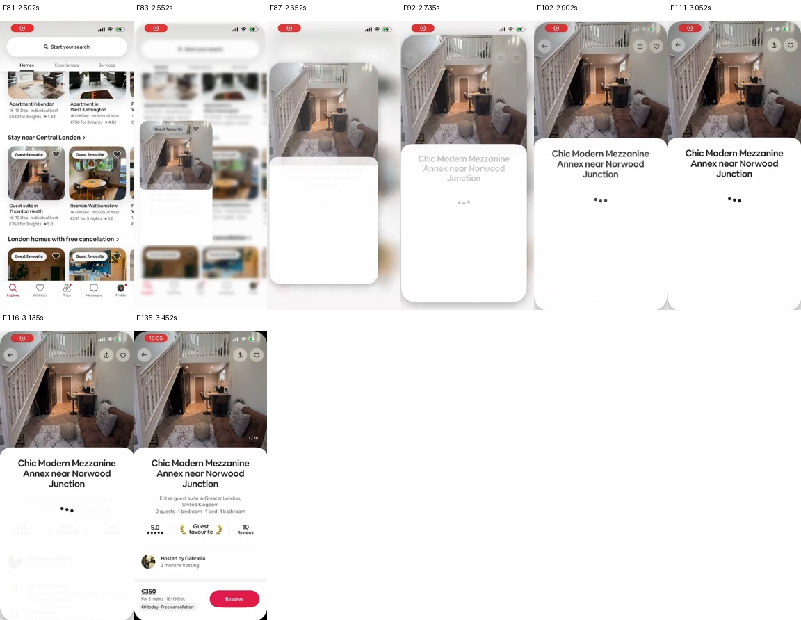
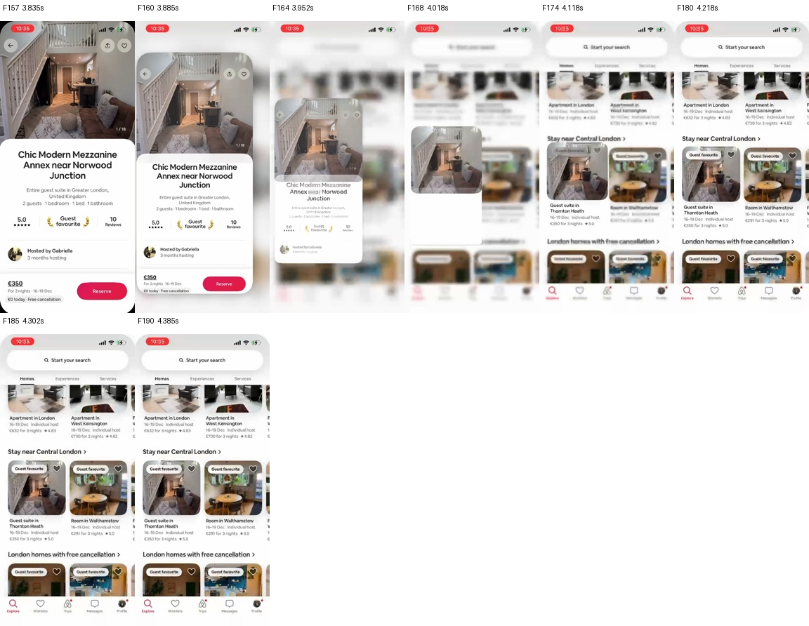

# Airbnb reference: frame review and implementation plan

Update: the subsequent image-only expanding-page implementation and its measured regressions are documented in [the current implementation report](airbnb-implementation-report.md).

7 September 2026. **Analysis and plan only; no app implementation or phone installation changed in this iteration.** The user reports the installed shared transition is still laggy and wants the motion in the supplied Airbnb video.

## Evidence and method

Source: `/Users/antash/Downloads/WhatsApp Video 2026-09-07 at 15.06.26.mp4`. Extracted **all 660 original decoded video frames**, with original presentation timestamps, without FPS resampling. Reviewed every frame in 11 consecutive numbered sheets. The clip is approximately 13.88 seconds, 384×832. Its average recording rate (~47.54 frames/s) is **not Airbnb's device FPS**. No touch indicator identifies the exact tap, and the recording cannot reveal Airbnb's implementation technology, thread scheduling, or GPU cost.

All frame sheets and timestamps: [sheet 1](airbnb-reference/sheet-01.jpg), [2](airbnb-reference/sheet-02.jpg), [3](airbnb-reference/sheet-03.jpg), [4](airbnb-reference/sheet-04.jpg), [5](airbnb-reference/sheet-05.jpg), [6](airbnb-reference/sheet-06.jpg), [7](airbnb-reference/sheet-07.jpg), [8](airbnb-reference/sheet-08.jpg), [9](airbnb-reference/sheet-09.jpg), [10](airbnb-reference/sheet-10.jpg), [11](airbnb-reference/sheet-11.jpg), [original timestamps](airbnb-reference/pts.json). Labels contain the one-based frame number followed by time in seconds. Full PNG frames remain in `artifacts/animation-performance/airbnb-reference/frames/`.

Our comparison uses the current source and the previously captured [Android emulator recording](final-resume-shared.mp4). It is not a matched iOS-vs-Android speed benchmark, and it does not measure the user's latest phone lag.

## What the frames show

The clip contains four openings and four returns, with feed scrolling between them. All four use the same visual pattern: the selected photo grows together with an attached white detail surface; the feed blurs behind it; the reverse animation contracts toward the originating photo. The title/content progressively appears inside the surface rather than flying independently from the list text.

### First opening, frame by frame at key stages

| Frame / time | Visible change | Difference from our implementation |
| --- | --- | --- |
| F81 / 2.502 s | Feed and selected card are at rest. | Establishes the actual origin, including scroll position. |
| F82–83 / 2.535–2.552 s | Feed softens; a photo-and-white-panel surface begins lifting from the selected card. The photo remains recognizable. | Our overlay carries the cover and title, not the whole detail surface. |
| F87 / 2.652 s | Photo, rounded outer boundary and white panel expand together. The background is still the feed. | Our Details page already occupies its final dimensions and fades in independently of the surface geometry. |
| F92 / 2.735 s | The surface nearly fills the screen. Title starts resolving in the white panel. | Our title replica moves and scales from the list label, creating another independently moving object. |
| F102 / 2.902 s | Image is close to final size; title and loading dots are visible. A small edge/settling movement remains. | Airbnb visibly allows the transition shell to open while detail content is still loading. |
| F111 / 3.052 s | Surface is effectively full-screen; photo and title remain continuous. | Around 500 ms of visible expansion from F83, not proof of a particular spring or exact programmed duration. |
| F116 / 3.135 s → F135 / 3.452 s | Additional details and bottom action appear after the main expansion. | Content readiness is visually separated from the opening motion. |

The first expansion is approximately **0.5 seconds**, with a decelerating finish. Our configured flight is **420 ms** after readiness gates. These are different measurements (recorded visible expansion versus configured animation duration); shortening our duration alone would not reproduce the reference. No exact Airbnb tap-to-motion latency or easing parameters can be inferred here.

### First return

| Frame / time | Visible change |
| --- | --- |
| F157 / 3.835 s | Full Details surface is still visible. |
| F160 / 3.885 s | Whole surface contracts; feed becomes visible and blurred behind it. |
| F164 / 3.952 s | Surface moves toward its original card position. Detail content starts fading away inside it. |
| F168 / 4.018 s | Smaller photo remains attached to the shrinking white panel. |
| F174 / 4.118 s | Photo is close to the original card geometry; source card metadata returns. |
| F180 / 4.218 s → F185 / 4.302 s | Feed clarity and the final handoff settle. |

This return contracts back to the source over roughly 0.4–0.45 seconds including visual settling. **Our close is a 240 ms fade, not a reverse shared transition.** The clip does not expose finger movement, so it cannot prove whether each return is a tap, swipe, or interactive drag.

Later openings show the same surface expansion near 4.85 s, 8.20 s, and 12.03 s; returns near 6.02 s, 10.12 s, and 13.02 s. These are locating timestamps, not independently fitted durations. The repeated first listing also shows progressively loaded content, so warm/cold data states must be separated in our tests.

## Why ours feels different, and what is actually known

| Area | Current app | Desired behavior |
| --- | --- | --- |
| Visual unit | Floating square cover plus separate title; full-size page fades beneath them. | One rounded expanding detail surface, with coherent image and content motion. |
| Image geometry | Cover grows and rotates into the small illustrated hero cover. | Continuous image crop and position throughout the expanding surface; retain the app's final hero layout initially. |
| Text | List title replica moves/scales into Details. | Title/content appear within the growing panel, without a detached flying label. |
| Start | JS orchestration navigates, mounts Details, obtains destination geometry and waits for image/title readiness before starting the UI-thread flight. | Start a lightweight visual shell from cached card data without waiting for full Details. |
| Background | Full-size destination opacity reveal; no matching feed blur. | Feed remains visually behind the expanding surface and returns on close. |
| Return | Fade out. | Reverse to the same card, with no feed scroll jump or duplicate image. |
| Loading | Image placeholders can appear during our recorded motion. | Keep the source image visible; fill additional details independently. |

Code evidence: `src/components/events/EventSharedTransition.tsx` (`open`, `land`, `tryStart`, `FlightOverlay`, `FlyingTitle`, `EventSharedTransitionPage`); `src/navigation/transitions.ts` (`sharedCoverScreenOptions`); `src/theme/motion.ts` (`eventSharedMotion`).

Our interpolation already runs through Reanimated shared values/worklets on the UI thread. However, preparing it involves React state, effects, destination layout measurement and image callbacks. Configured limits are source measurement 120 ms, destination landing 700 ms, title grace 50 ms and image grace 150 ms. **These are limits/fallbacks, not delays that always occur, and must not be added together as measured latency.** The readiness dependency is proven by code; its exact contribution to the user's phone lag needs trace markers. UI-thread rendering/compositing can also stall even when JS is not driving every frame.

The previous lifecycle repairs remain useful but did not redesign this visual model or prove that phone jank is fixed. We should not claim that the reported 40-second problem is solved.

## CSS: a measured option, not an automatic fix

Browser CSS is not this native app's rendering engine. **Reanimated 4.1.6 is installed and supports native CSS-style animations/transitions.** Their native C++ registries are present under `node_modules/react-native-reanimated/Common/cpp/reanimated/CSS/registries/`. They can reduce worklet interpolation overhead for suitable declarative effects; the amount must be measured.

Our existing Reanimated worklet flight already runs on the UI thread, separate from React's main JavaScript work. Changing it to CSS syntax does not automatically eliminate JS work before launch, image decoding, layout, clipping, alpha compositing, or UI-thread contention. It also does not fix the missing reverse/container animation.

Decision for the prototype: use one Reanimated shared progress value for the measured, reversible surface geometry and any interactive gesture. Compare a native CSS-style version for fixed-duration noninteractive properties using identical geometry, assets and timing. Choose from measured start latency/frame deadlines, not the syntax. Do not run CSS and worklet animations on the same property simultaneously. No WebView, blanket animation-library replacement, or dependency upgrade is needed to begin.

References: [Reanimated CSS animations](https://docs.swmansion.com/react-native-reanimated/docs/category/css-animations/), [Reanimated UI-thread animations](https://docs.swmansion.com/react-native-reanimated/docs/fundamentals/getting-started/), [React Native JS/UI performance and compositing](https://reactnative.dev/docs/performance). Newer experimental platform/CSS/shared-element features are version-specific; do not assume current documentation's newest flags exist in installed 4.1.6 or are production-ready: [feature flags](https://docs.swmansion.com/react-native-reanimated/docs/guides/feature-flags/).

## Implementation plan

### 1. Establish the current phone baseline and separate launch delay from jank

Add bounded, removable trace markers for press received, source bounds ready, image available, shell first visible, destination layout ready, flight start/end, and final handoff. Use a single monotonic clock or explicitly align trace clocks; JS timestamps alone cannot establish touch-to-photon latency.

Capture current release behavior with warm/cold images, first open, foreground age 60/120/300 s, repeated opens, and background/resume. Record frame deadlines separately from video. Keep data, device refresh mode, network and capture settings identical between builds. Do not perform event writes just to benchmark Details opens. Emulator traces remain useful; the user tests phone visuals, and phone profiling should be a clearly identified subsequent test session. iOS requires its own measurements.

Deliverable: per-stage baseline and recording. Identify whether the largest cost is preflight preparation, React/native mounting, or rendering during motion before changing engine settings.

### 2. Build an isolated expanding-surface prototype

Create a lightweight transition surface beside the navigator, owned by the existing shared-transition provider. It contains the current photo, its hero background and a white content panel; defer member/request lists, chat data, expensive derived content and data-dependent sections until appropriate.

Use cached card data immediately. Share a pure destination-geometry function between the surface and the final hero so opening does not wait for the full destination screen's layout callback. Measure the current source on the UI thread where supported; invalidate cached bounds on scroll/layout/orientation and verify the row still belongs to the same event.

Prototype fixed-size layers with transforms and a rounded clipping boundary. Keep image aspect ratio/crop stable; do not non-uniformly scale the entire screenshot or text. Profile clipping/radius updates explicitly—UI-thread execution does not make animated layout or masks free. Avoid per-frame React state updates, layout thrashing, image re-decoding and full-screen content re-renders. Resolve image reuse/preparation before hiding the real source; cold-image fallback must retain a visible source/placeholder, not an empty frame.

Retain the current settled Details layout initially: the app has a centered illustrated cover, unlike Airbnb's full-bleed photo. Match the expanding-surface behavior without silently changing that design. A literal full-bleed Airbnb hero would be a separate visual change.

Candidate files: `EventSharedTransition.tsx`, a focused `EventTransitionSurface.tsx`, shared hero geometry, and `EventDetailsScreen.tsx`/hero composition.

Deliverable: forward expansion with cached fixture data, correct clipping/crop, and no double image/title. Keep the old implementation available for same-build A/B testing until verified.

### 3. Make forward and reverse transitions one lifecycle

Use a clearly defined lifecycle: idle → preparing → opening → open → closing → idle. One UI-thread progress controls surface bounds, image geometry, radius and content/background reveals. Fade the title inside the panel instead of flying a separate text replica. Start with approximately 450–500 ms opening and 350–450 ms return as tuning candidates, not measured guarantees or inferred Airbnb spring constants.

Cache the originating route, list position and card identity. Keep the source list mounted and position stable; remeasure the source before return. Animate Back/close toward the original card, restoring the source image only after an aligned handoff. If the source was recycled, removed or is offscreen, use a deliberate short fade fallback instead of shrinking toward stale coordinates.

Keep the existing generation guards and AppState/orientation cleanup. Handle rapid taps, Back during opening, navigation away, nested routes, and dismissal cancellation. Do not leave invisible hit targets or background accessibility elements active.

Do not remove the transition surface solely because a timer ends. Hand off when the matching destination visual is ready and aligned; provide bounded failure behavior and an interactive loading/error shell when full details cannot load. No indefinite overlay or blocked navigation.

Deliverable: open/close repetition with zero blank handoff frames, no duplicate Main/Details routes, and preserved list scroll position.

### 4. Add reference polish, then test CSS/worklet alternatives fairly

Match background softening and content reveal separately from the core geometry. Benchmark the backdrop blur; avoid recomputing a costly live full-screen blur every frame. Compare a prepared/static softened backdrop with animated opacity if image preparation and memory costs are acceptable. Prefer a clean surface expansion over shipping a blur that regresses deadlines; document any visual compromise.

For CSS A/B, use exactly the same noninteractive motion/property set and capture windows; compare warm-start p50/p95, app-deadline misses, CPU/commit activity, and memory. Retain the better measured implementation. Do not enable global experimental fast-path flags without testing transformed touch targets and renderer/version compatibility.

After button/system-back return is solid, add gesture-driven dismissal with Gesture Handler and the same progress value, velocity-aware completion and cancellation. Explicitly arbitrate with the Details scroll view at its top and preserve Android system Back semantics. Gesture support is a desired enhancement, not something proven by the reference's touchless recording.

Deliverable: one coherent forward/reverse design, with separately reported cost of blur and any CSS change.

### 5. Regression checks and numerical acceptance

Proposed targets, **not achieved results or phone promises**:

| Measure | Acceptance target |
| --- | --- |
| Warm press → first visible motion | p95 ≤100 ms, measured end-to-end where capture permits |
| Visual handoff | Zero blank/duplicate-image frames in inspected captures |
| Alignment at handoff | Within 1 dp of destination/source geometry, no visible jump |
| App deadline misses on a physical 60 Hz test run | ≤5% in transition windows as an initial gate; lower is better |
| Long visible stalls | No >100 ms frozen interval during a transition |
| Repetition | Three batches of 30 open/close cycles; no stale overlay, navigation lock, or growing retained transition objects |
| Lifecycle | Pass 60/120/300 s foreground ages and 30 s/5 min background-resume, interruption and rotation cases |
| Other flows | No regression in Create success, toast, keyboard, sheets, scroll/touch, reduced motion or accessibility |

Use actual refresh deadlines for 90/120 Hz rather than applying a 16.67 ms budget everywhere. Report per-trial distributions, both gains and regressions, and sampling limits. Software-emulator failures must be distinguished from phone behavior, not hidden or converted into a claimed FPS gain.

Automated coverage: pure geometry including aspect ratios/safe areas, lifecycle/generation cancellation, missing/recycled sources, route history, image readiness/failure and gesture cancellation. Device/video checks: single-line and multiline titles, cold/warm images, rapid repeated taps, multiple list origins, Back halfway through opening, backgrounding and reduced motion.

Deliverable: updated before/after report with comparable recordings, frame timelines, screenshots, retained memory/resource checks, followed by a production-backend QA APK for user testing. Verify the embedded URLs and APK identity, force bundle regeneration when environment values change, and preserve phone app data on installation.

## Other repairs the user can test now

| Flow in the already-installed APK | What to test | Evidence limit |
| --- | --- | --- |
| Create Event | Open upward; close downward; successful submit closes directly onto My Plans; Back must not reopen submitted form. | One recorded success interval improved 2.89→2.10 s; generic open/close frame results were mixed. |
| Success toast | Enters downward after dismissal, holds, then exits cleanly. | Visually verified; no standalone FPS improvement claim. |
| Keyboard in Create | Focus event name and dismiss keyboard repeatedly. | Emulator app-frame p95 improved 112.9→69.3 ms opening and 70.9→60.2 ms closing in one small batch. |
| Submit shimmer / press feedback | No lingering shimmer or delayed action after leaving a screen; reduced-motion behavior. | Lifecycle cleanup, not demonstrated speedup. |
| Confetti | Celebration still appears, then stops; subsequent navigation after celebration. | Hidden overlay allocations 50→0 and registered frame callbacks 1→0 per overlay; no measured CPU/FPS percentage. |
| Group sheet | Open/close and compare feel. | Do not label optimized: measured opening regressed. |

Splash is preserved. Shared-transition smoothness remains unresolved and is the purpose of this new plan.
