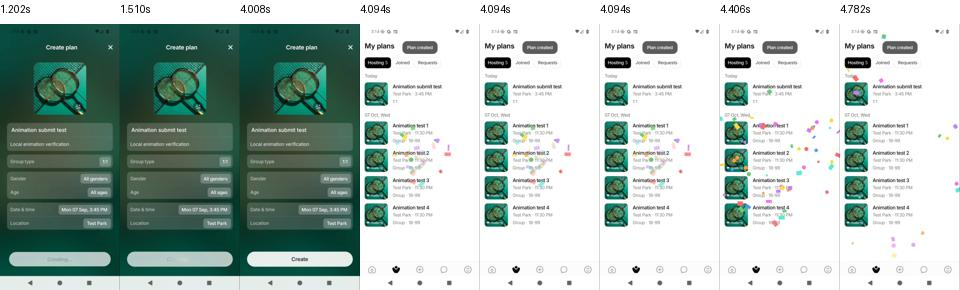
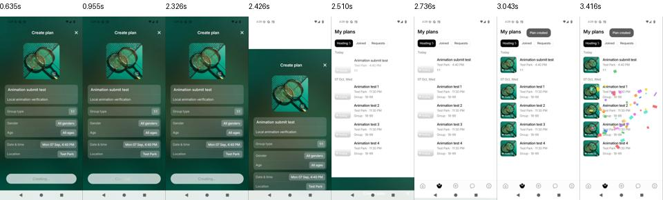
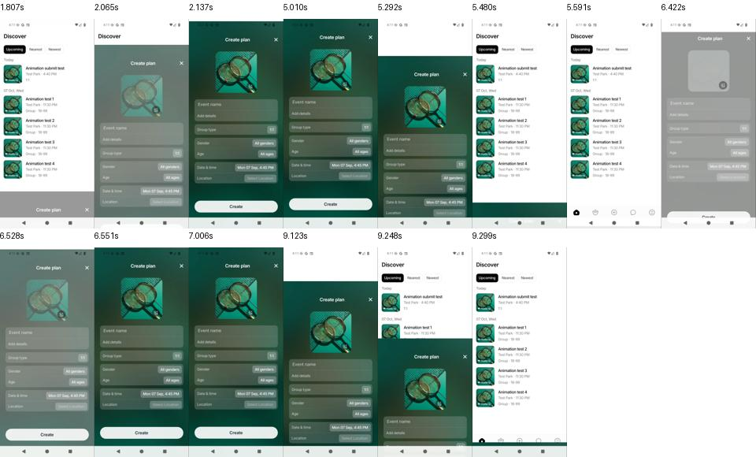
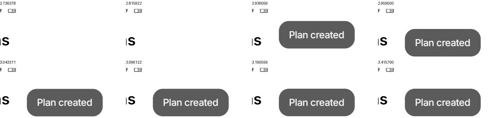
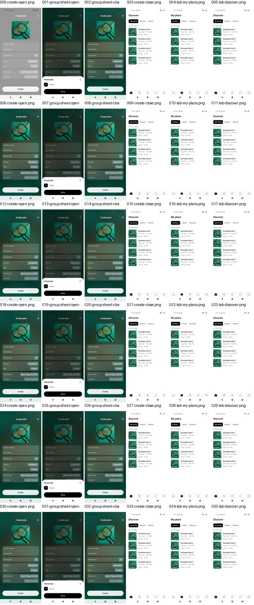
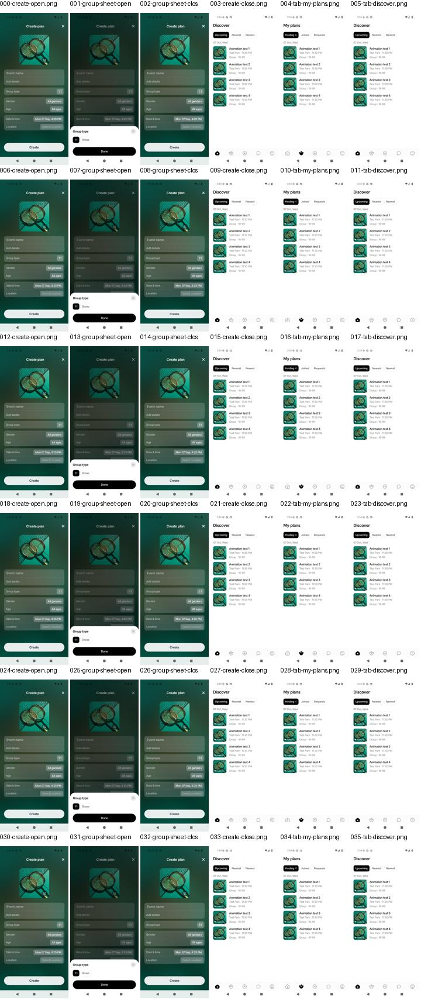
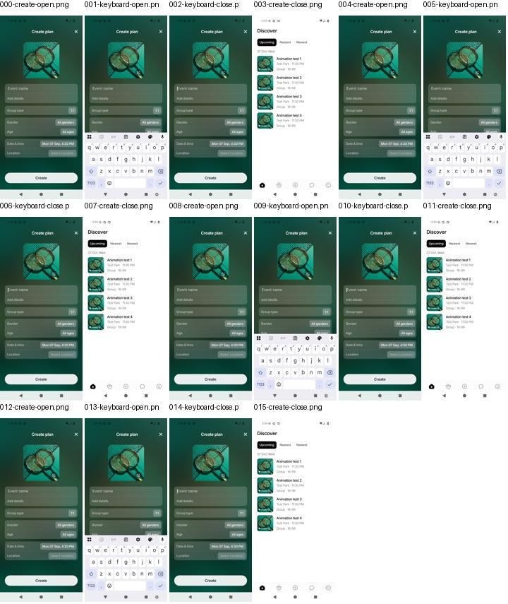
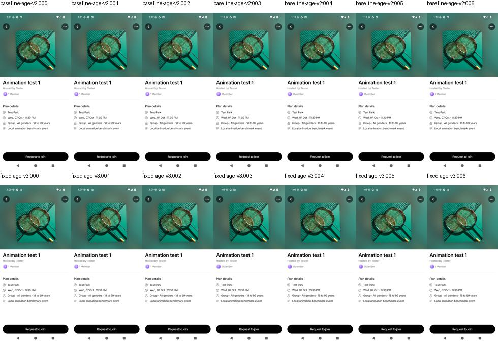
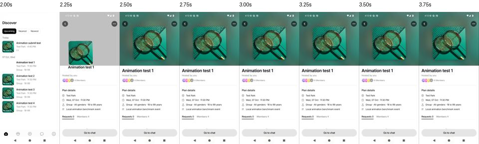

# Animation repair and measured performance — 7 September 2026

Update: the subsequent image-only expanding-page implementation and its measured regressions are documented in [the current implementation report](airbnb-implementation-report.md).

**The navigation/lifecycle repairs are implemented. App-wide smoothness is not yet proven.** Existing shared cover/title transitions, page animations, and splash remain. This report separates observed responsiveness, frame measurements, and code-level resource reductions. Measurements are from an Android emulator, not a representative phone.

## Successful Create Event: measured responsiveness and visible motion

The original build switched from the form to My Plans without a downward dismissal. The final recording shows the form moving down directly over My Plans, followed by the success toast and confetti. Intermediate candidates revealed Discover before switching tabs; those recordings are not used as the final result. The final helper reads the hydrated nested state, uses `jumpTo` (no parent focus change), and gives the selection two animation frames to render before starting dismissal. It abandons the delayed pop if the user has moved to another route.

| Observation | Baseline | Final |
| --- | ---: | ---: |
| First visible submitting feedback → My Plans revealed | **2,892 ms** | **2,102 ms** |
| Difference | | **790 ms shorter / 27.3%** |
| Downward form dismissal after successful submit | Absent | Present |
| Intermediate Discover screen in final recording | — | Not observed |

**One recorded observation per build**, measured from original video presentation timestamps and visually checked frames. This is destination-reveal latency, not tap latency, fully-loaded-content time, FPS, or a reliable population p95. My Plans' covers continue loading after reveal. The final closing motion is visible across approximately 310 ms of recorded frames, but sparse capture cannot establish its actual frame smoothness or exact spring duration. Adjacent-frame brackets put the baseline interval at approximately **2.806–2.959 s** and the final interval at **1.876–2.267 s**. These are capture-boundary brackets, not statistical confidence intervals. The raw PTS and measurement CSV are included. Production network/device differences can change the latency substantially.

[Baseline video](baseline-online-submit.mp4) · [Final video](final-v5-submit.mp4) · [Measurement JSON](submit-comparison.json) · [Final opening/cancel-closing video](final-v5-open-close.mp4)

The final open/cancel-close recording contains two cycles. Both directions occur, but image placeholders are briefly visible during entry and the emulator motion remains choppy. This is a functional direction check, not a smoothness pass. Android Back after success returned to Discover rather than the submitted form.

The success toast moves downward between the first visible frame and its settled position; the crop below uses original video timestamps. Confetti is visible in the full recording. No standalone toast/confetti FPS improvement is claimed.

## What changed and why

| Area / files | Delivered change | Evidence / practical limit |
| --- | --- | --- |
| Creation success — `completeEventCreation.ts`, `CreateEventScreen.tsx`, `App.tsx` | Read hydrated root state, select My Plans with a targeted tab `jumpTo` in the existing Main navigator, allow two animation frames for rendering, then pop the submitted form if the user has not left it. Shared helper covers signed-in and guest callbacks. | Real stack/tab router tests verify ordering and one Main route after five creations. Device recording verifies signed-in flow; guest callback is not separately measured. |
| Create request — `EventsContext.tsx` | Return after confirmed POST instead of waiting for another event-list GET; reconcile in the background. Protect confirmed creations against stale list responses until the server includes them. Clear pending items across account changes/deletion. | Context regression covers a stale list. This removes an unnecessary network dependency; its benefit varies with network/server delay. |
| Success toast — `EventActionBadge.tsx`, `MyEventsScreen.tsx` | Mount the animated native view before entry; wait for focused navigation interactions; slide from above; start hold after entry completes; cancel stale callbacks and timers. | Lifecycle tests and creation recording. No standalone toast FPS benchmark. |
| Shared cover — `EventSharedTransition.tsx` | Generation guards prevent old source measurements, image readiness, timers and completion callbacks from affecting a newer flight. Cancel and reveal destination on background/viewport change and cleanup. | Regressions for stale callbacks and lifecycle interruption; age/repetition emulator checks below. The user's exact 40-second failure was not reproduced. |
| Shared navigation — `transitions.ts`, `motion.ts` | Keep source screen attached and remove the separate 1,200 ms stack opening hold. Shared cover/title flight still uses 420 ms. | Removes competing lifetimes; **not** a measured 1,200 ms user-visible speedup. |
| Create images — screen and `CreateEventFormFields.tsx` | Use memory + disk cache for blurred background and foreground cover. | Avoids deliberately bypassing decoded memory cache on repeat use. Frame improvement is not independently proven. Additional memory use needs phone validation with varied covers. |
| Confetti — `ConfettiOverlay.tsx` | Only mount particle animation while active; explicitly stop its frame callback on cleanup; honor reduced motion. Preserve 50-particle visual design. | Tests: hidden particle allocations **50 → 0**, hidden registered frame callbacks **1 → 0**, per overlay. These are resource counts, not measured CPU/FPS percentages. |
| Press feedback — `ScalePressable.tsx` | Cancel deferred press and scale animation on unmount; respect reduced motion. | Cleanup regression tests. No separate FPS claim. |
| Submit shimmer — `CreateEventSubmitButton.tsx` | Cancel repeating animation when submitting stops/unmounts; respect reduced motion. | Regression tests; no separate frame benchmark. |
| Release configuration — `src/api/config.ts` | Static Expo public environment lookups so explicitly configured release URLs are compiled correctly. | Local release builds hit the isolated fixture backend. No production backend mutation. |
| Measurement tooling — `scripts/performance/` | Repeatable emulator capture, Perfetto queries, per-window frame statistics, comparison scripts and methodology. | Raw results, SQL and screenshots retained. |
| Tests and documentation | Regression coverage plus updated AGENTS, CLAUDE, shared-component guide and QA history. | Validation totals below. |

## Measurement conditions

- Baseline: repository HEAD `1190404`, with the same static environment lookup correction needed for local release URLs. Candidate: working-tree animation repairs described above.
- Android API 36 arm64, AVD WEIF_API_36, 720×1600, density 280, SwiftShader, Vulkan disabled; OS animation scales 1. Release builds; OTA disabled only in local QA builds.
- Same local backend, signed-in tester, four events, one fixed cover and deterministic place search. This removes network/catalog variation but does not simulate production network latency or a large varied event list.
- Compilers, tests and video encoding were kept out of performance windows. Recording was separate from Perfetto measurement batches. The host is shared with normal desktop processes, so scheduling variation remains.
- Six cycles per main batch; discard the first as warm-up, leaving five observations per scenario per batch. Measurements include rendering work within approximately 1.6 seconds after input, including ADB boundary overhead.
- Primary frame metric: **median of each trial's p95 actual app FrameTimeline duration**, milliseconds; lower is better. It is neither FPS nor animation duration. App-deadline miss rate is the proportion of app frame records labelled `App Deadline Missed`, potentially across multiple app surfaces.
- Native modal frame history disappears from gfxinfo after close, so sheet-close conclusions use Perfetto. Gfxinfo latency is retained as secondary evidence, never converted into FPS.
- Small samples and software rendering cannot establish physical-device smoothness or a statistically reliable population p95. Control tab transitions and repeat batches help expose variance.

## Create, sheet and tab frame measurements

Confirmation pair: five warm trials per scenario in each release build. These captures precede the final success-only `jumpTo` correction; the open/cancel/sheet/tab paths are identical. Positive change below means a shorter frame duration, not a higher FPS.

| Interaction | Baseline p95 ms | Candidate p95 ms | Reduction | App deadline misses, before → after |
| --- | ---: | ---: | ---: | ---: |
| create-open | 83.2 | 72.2 | +13.2% | 55.9% → 57.8% |
| create-close | 76.4 | 74.8 | +2.2% | 35.6% → 33.0% |
| group-sheet-open | 62.4 | 99.9 | -60.0% | 37.5% → 47.7% |
| group-sheet-close | 67.4 | 70.2 | -4.1% | 40.0% → 44.9% |
| tab-my-plans | 52.6 | 51.8 | +1.5% | 13.3% → 14.0% |
| tab-discover | 47.4 | 48.0 | -1.3% | 7.1% → 15.0% |

**Interpretation: no consistent smoothness gain.** Create opening improved in this pair but its miss rate worsened. Group-sheet opening regressed. The earlier valid pair also showed regressions; it is included below rather than selecting only the better run. Baseline itself varied considerably between batches (Create opening 69.1 → 83.2 ms; closing 63.1 → 76.4 ms). This prevents a causal app-wide speedup claim.

| Interaction | Earlier baseline p95 ms | Earlier candidate p95 ms |
| --- | ---: | ---: |
| create-open | 69.1 | 78.2 |
| create-close | 63.1 | 69.9 |
| group-sheet-open | 72.3 | 88.6 |
| group-sheet-close | 93.0 | 95.2 |
| tab-my-plans | 43.8 | 50.9 |
| tab-discover | 43.9 | 46.5 |

The earlier candidate had the same cache/confetti and open/cancel changes but preceded the final success navigation helper. Exact per-trial ranges, record counts, raw gfxinfo and query output are retained in the linked folders. Across these four batches, all **144/144** scenario destination screenshots were inspected and showed the expected screen. They establish functional completion, not smoothness.

[Confirmation comparison JSON](final-v2-comparison.json) · [Earlier comparison JSON](verified-comparison.json) · [Baseline variation](baseline-variation.json)

## Keyboard transitions

Four cycles per build, first excluded: **three warm trials** per interaction. All 32 scenario destination screenshots were inspected. These figures describe app-frame records while the keyboard appears/disappears, not the separate input-method process or complete keyboard presentation latency. They are one small batch, not a guaranteed gain.

| Interaction | Baseline p95 ms | Final p95 ms | Reduction | App deadline misses, before → after |
| --- | ---: | ---: | ---: | ---: |
| keyboard-open | 112.9 | 69.3 | 38.6% | 47.8% → 26.5% |
| keyboard-close | 70.9 | 60.2 | 15.1% | 37.7% → 21.6% |

The accompanying Create open/close steps are not pooled into the main table: the baseline keyboard run followed a submit/fixture cleanup and was a separate sequence. No keyboard animation library or duration was changed, so this observed improvement cannot be isolated to a specific repair.

[Keyboard raw comparison](keyboard-comparison.json)

## Rejected trials and exclusions

Android root texture caching and idle Create-screen preloading were tried, measured, and reverted. Neither gave consistent frame improvement; preload also added post-close work. The combined preload/cache trial is not the final delivered implementation. Cache-only image policy and active-only confetti remain, with the limits above.

An early baseline batch had an incorrectly terminated proxy WebSocket handshake causing reconnects; it was excluded and repeated after fixing the test harness. Hardware-renderer stalls, taps before splash completed, and location-filtered empty lists were also excluded. An initially empty trace pull was re-pulled after Perfetto finished flushing; empty traces are rejected by the summarizer.

## Shared transition ageing and repetition

The supplied WhatsApp recording contains Details opens/returns, not Create Event or background/resume. Frame timestamps show the list exposed for approximately **412 ms and 455 ms** before Details appears. This is a real visible discontinuity; the precise root cause in that recorded binary is not proven. The conflicting stack/overlay lifetime is one hypothesis addressed by the code repair. The video's recording cadence is not device FPS.

| Foreground age | Baseline gfxinfo p95 | Repaired gfxinfo p95 |
| --- | ---: | ---: |
| 15 s | 292.0 ms | 301.4 ms |
| 25 s | 131.4 ms | 135.1 ms |
| 35 s | 93.7 ms | 117.4 ms |
| 40 s | 121.3 ms | 110.8 ms |
| 45 s | 114.1 ms | 71.8 ms |
| 60 s | 102.6 ms | 99.8 ms |
| 120 s | 121.6 ms | 115.5 ms |

Both builds reached Details at every age: **14/14** observed destinations. Another batch of 20 opens per build reached Details: **40/40**. All destination screenshots were inspected. This signed-out fixture did not reproduce the reported animation failure after 40 seconds. Successful destination arrival alone does not prove a smooth flight. A formatter briefly overlapped the repeat batch, so that batch supports functional repetition only, not a performance gain.

[Earlier shared baseline video](baseline.mp4) · [Earlier repaired shared video](fixed.mp4)

## Final signed-in background/resume check

The final build remained backgrounded for **58.5 seconds**, retained the same process, resumed to Discover and opened Animation test 1 in Details. The screenshot and recording were inspected. This is one functional recovery observation, not a repeated latency benchmark or proof that the reported long-session bug is eliminated. The flight is still visibly slow on this software renderer.

[Resume recording](final-resume-shared.mp4) · [Settled Details screenshot](final-resume-details.png) · [Duration/process record](resume-check.json)

## Automated validation

- **117 suites / 1,425 tests passed** on the final navigation correction.
- TypeScript typecheck passed. ESLint: **zero errors**, 774 existing warnings.
- Android release builds succeeded.
- New regression coverage exercises real tab/stack routing across five repeated creations, stale list reconciliation, shared-flight callback invalidation, badge lifetime, press/shimmer cleanup, hidden confetti and reduced motion.

## Remaining acceptance work

No app-wide 60 FPS or 99% on-time pass is claimed. At 60 Hz the display has a 16.67 ms refresh budget; this is a target, not a result achieved here. The current emulator has substantial frame delays, including in control tab interactions.

The full plan still needs longer background periods (5 and 30 minutes), three independent stress batches, broader cover/data sizes, failed-submit and slow-network cases, guest end-to-end verification, and physical-phone testing. Notification banners, chat transitions, date/location/cover pickers, swipe pagers, and splash do not yet have individual before/after frame benchmarks. Splash was intentionally preserved. iOS has not been tested.

Sources for metric/cache interpretation: [Perfetto FrameTimeline](https://perfetto.dev/docs/data-sources/frametimeline), [Expo Image cache policy](https://docs.expo.dev/versions/v54.0.0/sdk/image/#cachepolicy). Reproduction commands are in [the measurement README](../../scripts/performance/README.md).

Full traces are preserved locally in `artifacts/animation-performance/` (gitignored); the smaller raw per-window data, SQL, comparison JSON, screenshots and videos are alongside this report. No authentication tokens or server logs are included.

APK identities are recorded in [builds.json](builds.json). The local candidate is `artifacts/animation-performance/final-v5.apk`; it uses emulator-only URLs and is not a phone-release artifact. No deployment or commit was made.

## Phone QA handoff

A separate production-backend release APK was subsequently built and installed on the user's Galaxy A56 at their explicit request: `artifacts/animation-performance/animation-phone-qa.apk`. Installation preserved app data; the installed APK checksum matched the verified artifact and MainActivity launched successfully. OTA is disabled in this QA binary to keep the bundled repairs under test. Its SHA-256 and endpoint checks are in `artifacts/animation-performance/phone-build.json`. The native manifest in the workspace was restored. This installation is not a physical-device smoothness benchmark; the user will test the animations.
