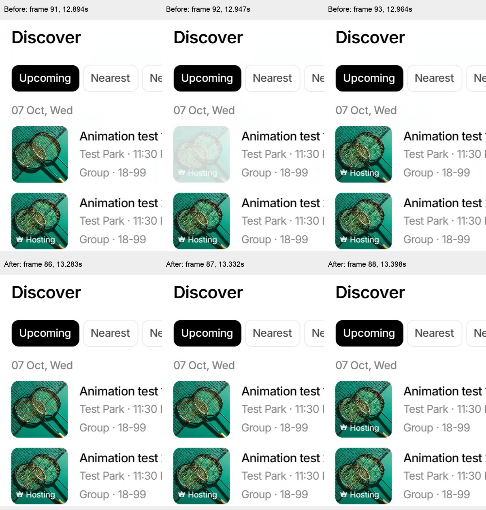

# Event Details return flicker — September 7, 2026

The small flash is visible in the previously delivered recording. The final repair removes it in four recorded Android emulator returns. The fixed production-server APK was subsequently installed on the Galaxy A56 and launched successfully; the user subsequently confirmed that the implementation works correctly on the phone.

## What the frames show

In the [original recording](airbnb-implementation/final-v8.mp4), frame 91 at **12.894389 s** shows the returned cover. Frame 92 at **12.946844 s** washes out the cover **and its Hosting badge**, while the neighboring title and card stay steady. Frame 93 at **12.963800 s** restores them. The damaged frame is presented for approximately **17 ms in this recording**; variable capture spacing cannot establish its exact on-device duration.

This was a handoff defect, rather than evidence that the whole return trajectory needed changing. The rounded Details surface finishes contracted directly over the source card. Its visibility previously depended on the JS `closed` phase, while removing the flying image and updating Reanimated styles can reach native rendering at different times. That left a white card-sized surface exposed when the overlay disappeared. The existing stack fade could then fade that white rectangle over the real card. Resetting progress during unmount also risked re-hiding the restored source.

## Final change

`src/components/events/EventSharedTransition.tsx` now hides the page surface when UI-thread progress reaches the source endpoint (`p <= 0.001`), before the JS completion callback removes the image overlay. Completed-return cleanup retains progress at zero instead of jumping back to one. Interrupted/fallback cancellation still resets normally.

The regression test checks page opacity **before** the JS completion callback, then simulates unmount cleanup and verifies that progress remains at zero and another event can open. No return duration, easing, image fade, stack fade, splash, or text-transition change is included in this repair. Image-source/fade experiments did not remove the defect and were reverted; retaining progress alone was also insufficient. The accepted build contains both endpoint visibility protections.

## Measured result

| Check | Before | After |
| --- | --- | --- |
| Cover contrast relative to its settled image | **19.9%** in the damaged original frame | **95.5% or higher** across all inspected post-return samples |
| Visible white flash | Present in original frame 92 | **0 observed in 4 returns** |
| Post-return frames below 90% contrast | Present | **0 / 87 captured samples** |
| Configured shared return duration | 400 ms | 400 ms |

The contrast number is an image-analysis proxy, not FPS or a timing benchmark: RGB contrast-to-white in crop `(36,359)-(160,435)`, above the badge, compared with the same video's final settled frame. Small differences reflect overlay/card sampling and compression. Post-return windows start at the first visually restored feed frame and end before the next opening, or at the end of the recording. [Exact ranges and minima](return-flicker/comparison.json), [original frame samples](return-flicker/original-contrast.json), and [analysis script](return-flicker/contrast.py) are retained. To reproduce, extract every original video frame with `ffmpeg -i NAME.mp4 -fps_mode passthrough NAME-frames/%04d.png`, then run the script with `NAME` and the containing directory; timestamp JSON files are included.

## Validation and evidence

- Release ARM64 build passed; local emulator API/WS fixture and OTA disabled. [APK fingerprint](return-flicker/apk.json).
- **49 focused tests passed**, typecheck passed, targeted ESLint passed, and `git diff --check` passed.
- Two 16-second recordings, four open/return cycles; **all 199 captured frames reviewed**, including the handoff and subsequent settled frames. App process was present after testing; final UI returned to Discover.
- [First two cycles](return-flicker/flicker-endpoint.mp4) and [two repeated cycles](return-flicker/flicker-endpoint-repeat.mp4). Frame contact sheets and timestamp/contrast JSON files are beside these videos.
- Android API 36 emulator, 720 × 1600, software graphics, local fixture; these observations do not establish physical-device or iOS smoothness. No new frame-time speedup is claimed, and the broader performance limitations in the [implementation report](airbnb-implementation-report.md) remain.

Phone handoff: installed APK SHA-256 `6ad4625df423b3d5194ed748fcdc09b65695258b545edc0ac4c2a92747661be8`; app data preserved. See `TEST_RUNS.md` for installation checks.
