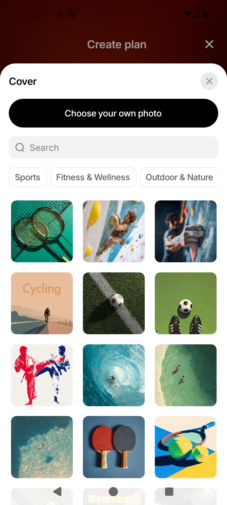
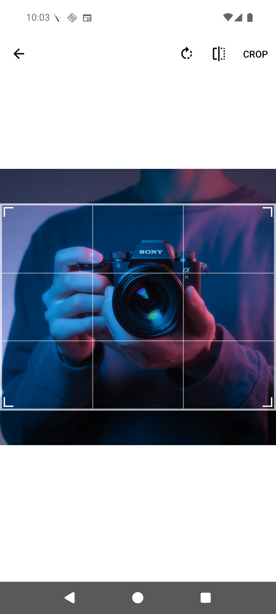
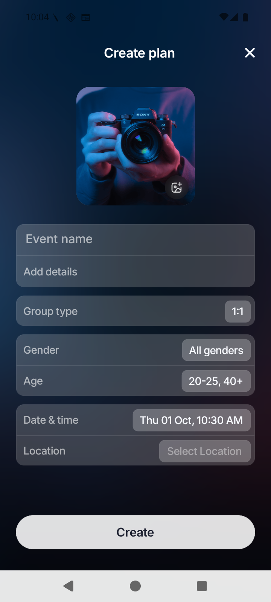
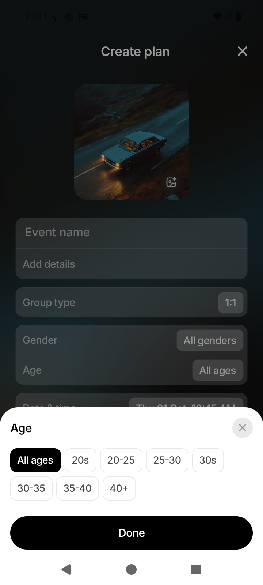
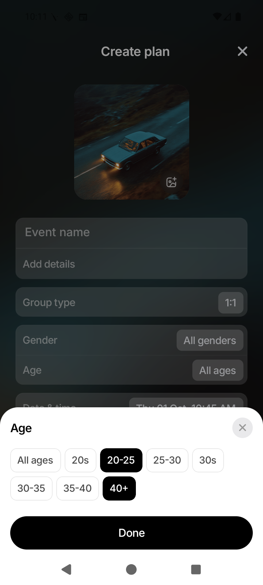
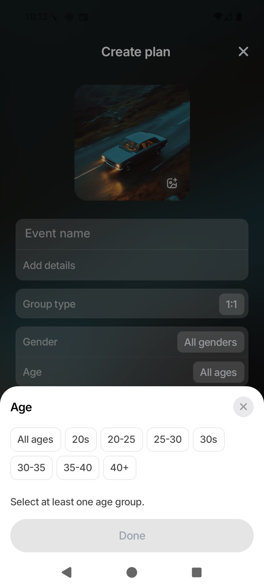

# Issue #159 — implementation and visual review

Date: October 1, 2026 (Asia/Kolkata).

Issue: https://github.com/antash-mishra/who-else-is-free/issues/159

Review branch: `codex/issue-159-visual-report`.

The two requested features are implemented. This report documents the current
component-based design for review; Sumit's final design remains pending.

## Custom plan cover

The existing cover sheet adds **Choose your own photo** above the catalog.
The native library picker supports cropping; selecting a photo updates the form's
cover preview. Hosts can replace it with another photo or select catalog artwork.
Uploads happen after sign-in and before the plan is saved. Successful upload
references are reused when an event-save attempt fails.

Owned upload references are stored separately from the generated catalog. The
server validates image contents, ownership, byte/dimension limits, orientation,
and generated filenames. Custom cover URLs propagate to event lists/details,
conversation artwork, notifications, and past plans.

## Multiple age groups

The age sheet retains the original wrapping chips and **Done** button through
shared `SelectionModalContent`; it now allows multiple chips to be selected.
Specific presets can be selected together. **All ages** clears the other choices;
selecting a specific group clears All ages. Removing every specific selection
shows guidance and disables Done. Dismissing without confirmation discards the
temporary choices.

The backend preserves exact range unions: `20-25` plus `40+` retains the excluded
26–39 gap. Overlapping ranges merge. Saved selections survive reload and editing;
unrelated edits retain arbitrary legacy ranges. Old apps continue to see the
legacy minimum/maximum envelope and cannot display gaps.

## Screenshots of the current design

These are unedited screenshots from the Android 16 `WEIF_API_36` emulator,
720 × 1600 pixels, running this branch's development bundle against an isolated
local server. The photo preview uses existing catalog artwork copied into the
emulator library as a test fixture; no personal library photos are published.
The native crop screen is provided by the image picker rather than custom app UI.

| Cover entry point                                                                                                                        | Native cropping                                                                                                     | Photo preview + confirmed ages                                                                                                        |
| ---------------------------------------------------------------------------------------------------------------------------------------- | ------------------------------------------------------------------------------------------------------------------- | ------------------------------------------------------------------------------------------------------------------------------------- |
|  |  |  |

| All ages default                                                                                                        | Multiple groups selected                                                                                                     | Empty selection                                                                                                                       |
| ----------------------------------------------------------------------------------------------------------------------- | ---------------------------------------------------------------------------------------------------------------------------- | ------------------------------------------------------------------------------------------------------------------------------------- |
|  |  |  |

The three age captures were refreshed after user feedback to preserve the
original chip design. The cover captures remain from the preceding capture pass.

## Android capture verdict

**PASS for the captured interactions:** opened the cover catalog/photo entry;
opened the native library picker; selected and cropped the test image; returned
to the form with the local cover preview and matching blurred background;
selected separated age presets; confirmed the summary; and verified the
empty-selection guidance and disabled Done button.

The emulator initially reproduced the previous system/app unresponsiveness.
A cold boot using the host GPU recovered it without clearing saved app data.
The existing native development build eventually loaded the fresh Metro bundle;
a redundant rebuild was canceled. Temporary diagnostic logging was removed
before these captures and is not included in the commit.

These captures do **not** establish a complete native publish/edit/reload test:
the pictured plan is a draft. Upload persistence and exact saved ranges have
automated API/context coverage. Physical-device and iOS verification, the wider
release matrix below, and Sumit's final design review remain pending.

## Validation

- Full frontend suite: 125 suites / 1,450 tests passed on October 1.
- `npm run typecheck`: passed, including after the age-chip design correction.
- Age-chip correction: 23 relevant SelectionModal/age-picker tests passed.
- `npm run lint`: passed with 689 warnings from the existing baseline.
- `cd server && go test ./...`: passed (cached).
- New feature modules and contract/plan documents: Prettier check passed.
- `git diff --check`: passed before report completion.

## Remaining before release

- Review and integrate Sumit's final design.
- Complete physical Android and iOS checks, including limited photo-library
  access, cropping/orientation, large images, cancellation, offline/slow uploads,
  guest sign-in, create/edit for both plan types, font scaling, and reduced motion.
- Verify deployed database/media volume topology, restart durability, and a
  backup/restore of both SQLite and uploaded files.
- Ship additive server support before the new app. Retain schema/media during
  rollback and verify older-server compatibility.

API/storage details: [Custom plan covers and age groups](../docs/custom-plan-covers-and-age-groups.md).

Implementation checklist: [Issue #159 feature plan](issue-159-create-plan-feature-plan.md).
