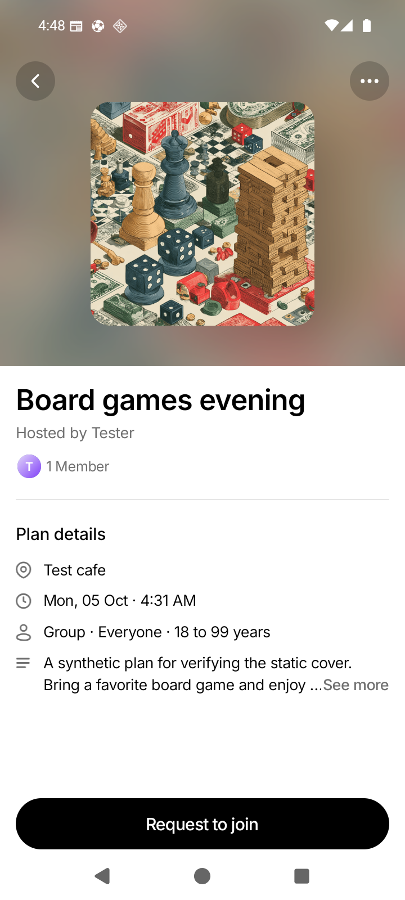

# Issue 162: static Plan Details cover

Implemented October 4, 2026 for [issue #162](https://github.com/antash-mishra/who-else-is-free/issues/162), on branch `codex/issue-162-static-cover`, based on `origin/master` at `cc019e1`. The [original reproduction and plan](./issue-162-plan-details-cover-fix-plan.md) records the baseline.

The cover now renders level at its final size, with no entry scale, fade, rise, or resting tilt. Both cover images disable image transitions. Cover and blurred backdrop scroll with page content. Android has no hero elevation or shadow; iOS retains its existing shadow style.

## Implementation

- Replace the hero's `Placed` wrapper and Reanimated transforms with ordinary `View` and `Image` elements. Preserve square dimensions, crop, rounding, blur, overlays, and safe-area spacing.
- Remove the hero-only shared scroll value and listeners. Use `ScrollView` for ordinary details and retain virtualized `FlatList` for read-only details.
- Apply legacy shadow properties only on iOS. Leave shared list-row and going-avatar `Placed` behavior unchanged.
- Update the documented hero contract. Ignore `.data/` so local QA databases, tokens, logs, and raw investigation artifacts stay out of Git. Only reviewed synthetic visual evidence is published below.

## Verification

Before production changes, focused regression tests failed on the existing entry transforms, image-transition duration, scroll translation, and Android elevation. An initial shadow-test mock failed for an unrelated setup reason; it was corrected before recording the genuine Android regression failure. The final tests cover first mount, same/different URI remounts, normal/reduced-motion settings, static geometry, scroll events, zero image transitions, and Android/iOS shadow styles.

- Focused frontend checks before rebasing: 12 suites / 138 tests passed.
- Final full frontend run after rebasing: `npm test -- --runInBand --silent`, 125 suites / 1,460 tests passed.
- `npm run typecheck`: passed.
- `npm run lint`: passed with 0 errors and 751 warnings (includes existing repository warnings and the local investigation harness).
- Touched-file Prettier checks and `git diff --check`: passed.
- Android debug build: `npm run android -- --no-bundler` with Java 17 and explicit local API configuration, passed. Setup retries resolved an incompatible CLI flag combination and missing Java configuration before the successful build.
- Local QA backend compiled with `go build`; backend test suite was not run because no backend behavior changed.

## Android visual evidence

Verified on `WEIF_API_36` / `emulator-5554`, Android 16 / API 36, 720 × 1600, density 280. Captures use the existing `com.whoelseisfree.app.toastqa` native development client serving this checkout's final source through a dedicated Metro on 8084. A separate rebuilt main development package also compiled successfully; the published recordings are from the QA package. The API was an isolated local server on 8182, using synthetic users and plans only. Production data and services were not used.

The screenshot shows a horizontal, square cover without an Android shadow. Entry video shows opening and reopening the same synthetic plan: the image appears at its final geometry without a cover animation. The normal stack route slide still runs. The scroll video shows expanding the description, scrolling down, and returning upward; cover and text move together without drift. Recordings were pulled after completion and inspected as filmstrips.

In a measured scroll, the title moved from y=679 to y=441, and the cover's bottom edge moved from y=579 to y=341: both moved 238 pixels. Previously these moved by different amounts (233 versus 186 pixels).

- [Opening and reopening the cover (MP4)](./screenshots/issue-162/cover-entry-android.mp4)
- [Scrolling down and back up (MP4)](./screenshots/issue-162/cover-scroll-android.mp4)

## Remaining verification

Physical Android, iOS native rendering, release builds, uploaded covers, and manual past-plan/read-only navigation were not verified. Read-only screen behavior, alternative image URIs, reduced motion, and preserved iOS shadow are covered by automated tests. Full-repository formatting was not run; touched files were checked. These captures confirm the fix in the Android emulator development client, not a deployed release.
