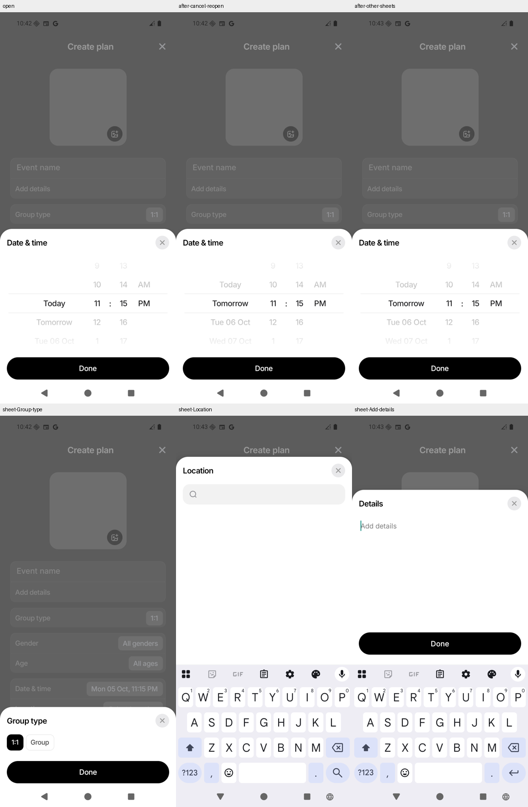

# Issue 163: prepared date picker and the 100 ms target

Local implementation, October 4, 2026, following commit `7107bd0` and the
[issue discussion](https://github.com/antash-mishra/who-else-is-free/issues/163).
The [previous investigation](./issue-163-date-picker-latency-root-cause.md)
removed the blank-content stage and Android native Dialog startup. Its remaining
median animation-start delay was 185 ms. Mounting/layout and subsequent wheel
reconciliation were still on the tap path; no network request supplies picker values.

## Changes

- `CreateEventDateTimeSheet` prepares Android's bounded picker after navigation
  interactions settle. The shared host retains that owner's native subtree
  through close/reopen and other sheets, then releases it on blur/unmount.
  An early tap opens immediately even if preparation has not run yet.
- `BottomSheetModal.keepMounted` is opt-in and inline-only. Idle prepared
  surfaces stay laid out but are invisible and excluded from touch,
  accessibility and hardware Back. Active/closing inline sheets isolate the
  form. Ordinary modal owners still reuse one native Modal; standalone callers
  keep native presentation. Stale owner completion cannot close a newer sheet.
- Picker wheel elements, labels and list props are memoized by logical selection
  and calendar-day bounds. Refreshing time-of-day bounds or toggling visibility
  no longer reconciles all the wheel rows. Stable handlers consult the latest
  visibility ref to reject late hidden events. The prepared wrapper also skips
  unrelated form typing updates.
- Hosted registration and sheet visibility/animation setup use layout effects.
  A prepared opening skips the additional frame wait and starts from measured
  sheet height, removing invisible full-screen travel. Spring parameters and
  native modal `onShow` entry remain unchanged.
- The retained picker cancels pending settles, discards unconfirmed edits and
  repositions native wheels while hidden. This reset is opt-in through
  `prepareWhileHidden`, preserving the ordinary modal's draft during exit.
  Texture rasterization ends after closing even though the layout remains mounted.

Retention trades a bounded allocation while the form is focused for less work
on taps. It does not eliminate preparation cost or guarantee a fast tap before
preparation has finished. Other sheets and iOS do not retain hidden picker rows.

## Measurements

The final controlled recheck measured **164 → 51 ms median to the first UI
motion sample**, about 69% lower. **Nine of ten candidate openings were below
100 ms**, including the first opening at 61 ms. One repeat took 293 ms; it is
retained in the result. Animation-start median fell from 140 to 30 ms.

| Measurement, ms                 | Latest commit | Prepared candidate |
| ------------------------------- | ------------: | -----------------: |
| First UI motion, median         |         163.5 |                 51 |
| First picker opening, UI motion |           515 |                 61 |
| UI motion range                 |       138–515 |             40–293 |
| Openings below 100 ms           |          0/10 |               9/10 |
| JS animation-start median       |           140 |               29.5 |

| Opening | Latest commit: first UI motion, ms | Candidate: first UI motion, ms |
| ------- | ---------------------------------: | -----------------------------: |
| 1       |                                515 |                             61 |
| 2       |                                219 |                            293 |
| 3       |                                212 |                             43 |
| 4       |                                138 |                             41 |
| 5       |                                163 |                             40 |
| 6       |                                155 |                             58 |
| 7       |                                142 |                             45 |
| 8       |                                154 |                             45 |
| 9       |                                164 |                             86 |
| 10      |                                164 |                             57 |

These measure input release to JavaScript animation startup and the first
observed UI-thread spring progress sample, not presented-pixel latency,
animation completion, FPS, or a reliable population p95. The outlier had an
86 ms delay before the handler and additional delay before host registration;
its sheet-render to animation-start stage was 11 ms. No trace establishes
whether OS scheduling, logging, GC or another cause accounts for that delay.
A hard per-interaction 100 ms guarantee is **not established**.

The earlier same-session baseline was 206 ms median UI response and 185 ms
animation start. The final baseline recheck was faster, so the smaller 164 ms
baseline is used in the headline rather than selecting the larger improvement.
All 20 final destination screenshots were inspected: each reached the populated
picker, including the outlier. Screenshots do not measure first presented pixels.

The UI probe rejects the reset to the starting position: a sample must be moving
and at least 0.5 points inside its recorded opening distance. Its timestamp is
captured on the UI thread before forwarding the result to JavaScript. Geometry
is preserved with each marker for audit. Earlier prepared-candidate UI probes
could count the starting-position reset and are excluded from the accepted UI
comparison; their animation-start stage logs remain diagnostic evidence.

## Validation

- Full frontend: 128 suites, 1,493 tests passed.
- Typecheck passed. Lint passed with zero errors and 748 warnings, down from 751.
- Regression coverage includes prepared subtree reuse/release, hidden touch and
  accessibility isolation, Back listener cleanup, owner replacement, presentation
  switches, early taps, focus lifecycle, draft cancellation, native offset reset,
  late momentum guards, stable wheel props, selection, bounds and wrapping.
- Clean Android release/Hermes assembly passed, including native lint tasks.
  The resulting APK contains no timing probes, uses local API/WS URLs and has
  OTA disabled in the benchmark manifest; production config is unchanged.
- Clean-release native smoke passed: selection/Done, cancellation with hardware
  Back, saved-selection reopening, fast minute fling, opening all five other
  input sheets, reopening the date picker afterwards and release on navigation.
  The active picker excludes the form from the accessibility tree; the hidden
  picker does not intercept touches or Back.
- Native screenshots were visually inspected. Location and Details still open
  with the keyboard correctly raised. A direct form-keyboard-to-date handoff
  was not exercised: scrolling the form dismissed the keyboard before the date
  field became reachable in this harness.
- Touched-file Prettier and `git diff --check` passed.

Physical Android/iOS, signed-in Edit Event, exact input-to-presented-values
latency and sustained frame smoothness remain unverified. An observed median
below 100 ms is not a guarantee that every interaction or device meets 100 ms.
The existing spring continues after the initial response.

## Remaining work toward consistent sub-100 ms

The repeat outlier now dominates the tail rather than wheel rendering. The next
useful measurement is a larger release sample on a physical Android phone, with
Perfetto/Hermes profiling around input delivery, handler execution and host
registration. Compare input-to-presented populated values and p95 as well as
first motion. If traces confirm JavaScript scheduling stalls, move the opening
trigger to the UI thread or reduce the competing task they identify. Do not
shorten the spring to hide a delayed start: that changes completion time without
removing the delay. Early taps before preparation and signed-in Edit Event need
separate samples.

## Reproducibility and limits

Release/Hermes builds run the actual app and providers in the separate package
`com.whoelseisfree.issue163full`. Android API 36 ARM64 software-rendered emulator,
720 × 1600, density 280, all animation scales 1×. Offline guest Create Event,
empty cover state, local API/WS URLs compiled into the bundle, OTA disabled only
in the local benchmark manifest. No production account, backend write, or event
submission. The normal clock determines the initial selection, so selected
minutes were not frozen across builds. Numeric captures have no concurrent
builds, tests or recording.

The first sample is the first picker opening after the form is ready; it is not
cold application-launch latency. Prepared wheel layout occurs before that tap.
Input comes from the native `LatencyInput` driver. Device wall-clock timestamps
align native ACTION_UP and stage/UI markers. JS layout callbacks include native
event delivery and are not pure layout CPU time.

Accepted numeric batches: `baseline-final-run1/` and `candidate-cached-run1/`.
The timed candidate precedes the modal-only hidden-draft reset opt-in; the clean
build explicitly enables that same prepared Android behavior while preserving
ordinary modal exit drafts.

Raw APKs, build logs, source snapshots, input markers, stage logs, geometry,
per-opening screenshots and analyzers are retained under ignored
`.data/issue-163/sub100/`. Startup/preflight attempts that never reached the form
are retained separately and excluded. The bundled JDK's compiler crashed on the
first build; the installed current JDK 17 completed subsequent builds. Temporary
stage/UI probes are removed from production source. Issue #163 remains open for
release verification.
