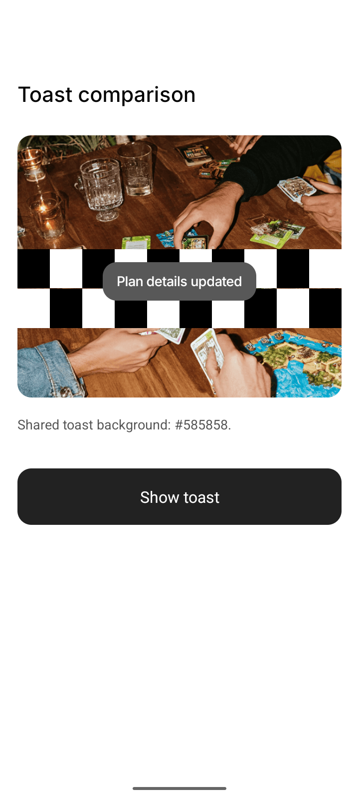

# Issue #164 — Exact toast background color parity

## Required behavior

Action toasts must have the exact same background color on Android and iOS,
independent of the screen beneath them. Native blur/tint implementations produced
visibly different results despite receiving identical props.

## Plan and implementation

1. Sample the existing iOS toast over a white backdrop: RGB (88, 88, 88), `#585858`.
2. Specify a regression at the rendered toast boundary for both platforms and
   prove it fails before implementation.
3. Use one opaque `colors.actionToastBackground` token and a shared white
   `colors.actionToastText` token. Remove native blur/tint and overlay layers
   from this toast so neither the OS nor backdrop can alter the settled color.
4. Preserve the label, spacing, clipping, reduced-motion behavior, hold timing,
   swipe dismissal, and entry/exit animation.
5. Verify the rendered pixels on Android and iOS, then update PR #169 and issue #164.

The background is deliberately fixed rather than frosted: a translucent material
changes color with its backdrop and cannot satisfy the requested exact color
contract. The original blur-presence regression was replaced by an exact-color
regression because the requested contract changed.

## Verification

- Red: both platform cases failed because the rendered badge had no fixed background.
- Green: all seven badge tests passed, including exact `#585858` on both platforms
  and absence of native tinting layers.
- Full frontend suite: 121 suites / 1,444 tests passed. Dependencies retain the
  repository's existing stack gesture patch; no dependency patch changes are included.
- Typecheck, lint (zero errors; existing warnings), touched-file Prettier, and
  `git diff --check` passed.
- Android API 36 emulator and iOS 26.5 iPhone 17 Pro simulator rendered the actual
  component in a temporary comparison screen over matching photo/checkerboard
  backdrops. Six interior background pixels on each screenshot were sampled:
  all twelve were exactly RGB (88, 88, 88), matching the sampled iOS white-page reference.
- Verification used cached native development builds with current branch JS from
  Metro. The iOS build used a temporary local bundle copy with synthetic Firebase
  configuration and analytics collection disabled. The comparison screen and
  temporary entry-point changes were restored and are not shipped.
- Physical devices and release builds were not tested. Backend tests and
  whole-repository formatting were not run; backend source is unchanged and the
  repository documents a legacy formatting baseline.

