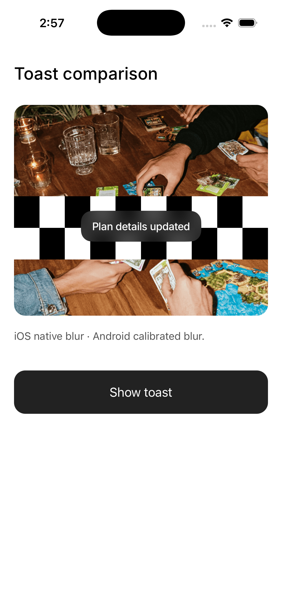
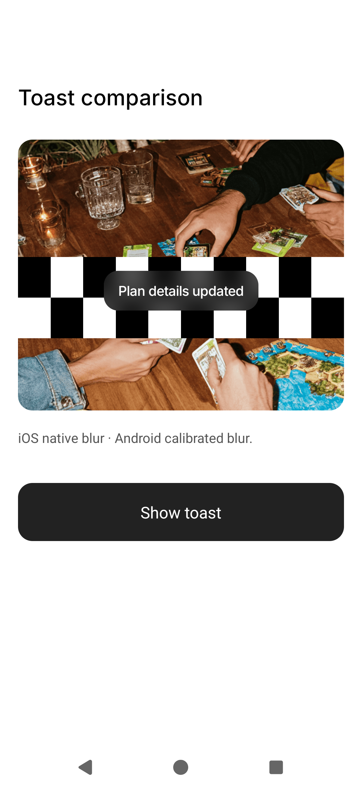
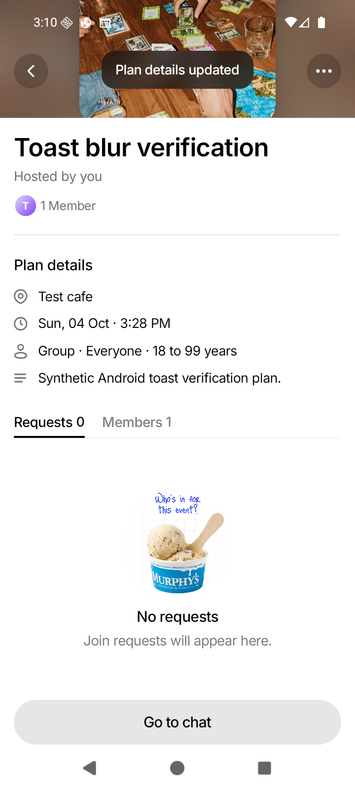

# Issue #164 — Match Android action toast blur to iOS

## Cause and plan

Enabling the missing FrostedSurface blur restored texture but did not match the
iOS material. The solid gray replacement was removed because iOS blur must stay.

Installed expo-blur 15.0.7 uses Apple's UIVisualEffectView on iOS and Dimezis
BlurView on Android. Dimezis selects RenderEffect on API 31+ and RenderScript on
older APIs. Its tint, radius, downsampling, and capture differ from Apple.
[Expo's SDK 54 documentation](https://docs.expo.dev/versions/v54.0.0/sdk/blur-view/)
also documents the different perceived intensity.

The separate JS scrim and label were included in Android's backdrop capture:
Dimezis excludes its own BlurView, not those siblings. Applying the scrim again
made the result too dark. Changing the reduction factor alone did not fix this.

1. Preserve iOS dark blur at intensity 65 and its existing 40% black overlay.
2. Exclude the entire Android toast, including text, from backdrop capture.
3. Use one custom filter across Android APIs, with density-aware strength and
   one calibrated tint; preserve general FrostedSurface behavior.
4. Compare native output over flat colors, alternating bars, and the actual
   EventActionBadge; verify label, clipping, entry, and dismissal.
5. Test, document the native build requirement, and update PR #169 with evidence.
   Leave the issue thread untouched following the user's subsequent instruction.

## Implementation

ActionToastSurface owns the toast material. iOS retains native FrostedSurface
blur and its overlay. Android uses the local Expo module in modules/toast-blur.
Dimezis handles live capture and lifecycle; our filter replaces OS-specific
filtering with three separable box passes approximating a Gaussian.
Premultiplied alpha avoids fringes around transparent pixels.

The Android filter samples the toast bounds, uses sigma 12.5 dp, and compensates
for Dimezis' rounded downsampled bitmap width. Its single tint is
rgba(11, 11, 11, 175/255). Capture excludes the complete toast, preventing its
overlay and label from feeding back into the background. Yoga owns text
measurement/layout; native LinearLayout must not remeasure the label after
allocating all available width to its backdrop.

The new native module requires rebuilt clients. App version 1.0.1 preserves the
appVersion OTA policy while separating this update from runtime 1.0.0. Do not
publish its JavaScript to older native clients. Expo Go cannot load this Android
view.

## Native verification

Android API 36 emulator and iPhone 17 Pro / iOS 26.5 simulator ran the actual
shared component from this branch on a temporary comparison screen. The screen
and entry-point change were removed. Android was checked at densities 1.75 and 3;
its original emulator dimensions/density were restored.

- Fresh black/white material probes: RGB (8, 8, 8) / (88, 88, 88) on both platforms.
  These depend on the backdrop; the toast is not an opaque fixed fill.
- Alternating bars: center-row brightness at 500 normalized positions across
  the central half of a 10-bar backdrop. iOS range 20–76; Android 20–77; mean
  absolute difference 0.83/255. This approximation does not establish pixel
  identity on every image, device, or future iOS version.
- Actual toast: full label, smooth backdrop, rounded corners, entry animation,
  and automatic dismissal on both platforms.
- Warm development filter samples with a 13,248-pixel capture took about
  1–1.4 ms on this emulator. Cold samples under host memory pressure were much
  slower; this is diagnostic evidence, not a release performance benchmark.
- QA caught clipped Android text; preserving Yoga's measured child sizes fixed
  it. Final screenshots use that rebuilt implementation. Timing logging was
  removed.

| iOS native material                                     | Android custom filter, density 3                                   |
| ------------------------------------------------------- | ------------------------------------------------------------------ |
|  |  |

[Android at density 1.75](screenshots/issue-164-android-toast-custom-blur.png).

Normal Android app verification also passed: synthetic tester dev-login → My
plans → Event Details → action sheet → Edit plan → Save, then scroll the cover
under the toast. Back navigation, Discover, My plans, Create plan, Chat, and
Profile displayed correctly. This is a smoke check, not exhaustive feature QA.

## Automated verification

- Focused badge/material suites: 12 tests passed.
- Full frontend suite: 121 suites / 1,444 tests passed.
- TypeScript typecheck passed.
- ESLint passed: zero errors, 723 warnings.
- Native filter: 5 tests passed, covering flat colors/alpha, symmetric edges,
  fresh captures, tiny captures, and horizontal/vertical consistency.
- Native debug assembly and module lint passed. Module lint reports one
  ViewConstructor warning: Expo constructs this view with AppContext instead
  of XML layout-editor constructors. Dependencies also report deprecated
  Gradle APIs.

Physical devices, older Android APIs, accessibility/OS material variations, and
release-mode performance remain unverified. Backend tests and whole-repository
formatting were not run. Prettier passed for touched JavaScript/TypeScript, JSON,
and Markdown files; git diff --check passed.
