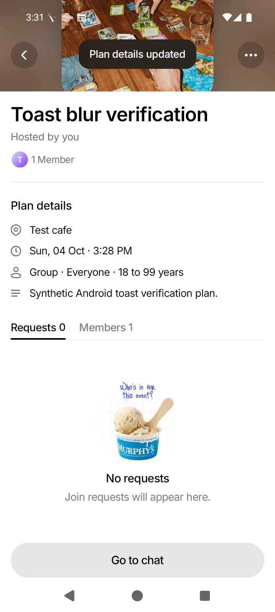

# Issue #164 — Android toast blur

## Problem

The shared action toast used FrostedSurface without its blur option. It therefore
painted a flat translucent tint, leaving text, card edges, and images sharp beneath it.

## Plan

1. Add a toast-boundary regression test for Android and iOS; prove it fails because
   no BlurView is mounted.
2. Enable the existing shared blur path on EventActionBadge, preserving its dark
   tint, intensity, clipping, label, and animation lifecycle.
3. Document why toasts need blur even outside photography.
4. Run focused and full frontend tests, typecheck, lint, and touched-file formatting.
5. Verify on an Android emulator, capture the actual rendered toast, then publish
   the PR and screenshot evidence to the issue.

## Implementation

EventActionBadge now passes blur to FrostedSurface. The existing primitive selects
Android's dimezisBlurView method and keeps native iOS blur. The opaque gray replacement was removed on 2026-10-04 after the user clarified
that the iOS frosted appearance must be preserved. No custom blur is introduced.

The native photo/checkerboard comparison showed different material appearance on
Android and iOS. Restoring blur does not resolve that color discrepancy; matching
the Android tint to iOS remains a separate outstanding adjustment.

## Verification

- Red: both new platform cases failed with no BlurView mounted; existing five
  badge tests passed.
- Green: badge and FrostedSurface suites passed (12 tests).
- Full frontend suite: 121 suites / 1,444 tests passed after applying the existing
  `patches/@react-navigation+stack+7.6.12.patch` to an isolated dependency copy.
  The first run lacked that dependency patch and failed its two guard tests;
  those same unchanged tests also failed in isolation before the patch was applied.
- Typecheck passed. Lint passed with 724 existing warnings and zero errors.
- Prettier passed for touched TypeScript and this plan. `git diff --check` passed.
- Android API 36 emulator: reused the existing native development APK with Metro
  serving this branch on port 8082 and a separate local dev-login backend on 8083.
  Signed in as the synthetic tester, created synthetic plans through the local
  API, opened My plans → Event Details → Edit plan → Save, and captured the
  `Plan details updated` toast while scrolling the cover underneath it. The label
  stays readable and the toast dismisses automatically.
- Physical Android and native iOS verification were not run. Backend tests were
  not run because backend source is unchanged. Whole-repository formatting was
  not run because the repository documents a legacy formatting baseline.

## Restoration checks (2026-10-04)

Restored the exact blur implementation previously exercised on the native Android
and iOS comparison harness. No fresh native screenshots or broad mobile smoke
test were captured for this restoration.

Focused badge/material tests (12), full frontend tests (121 suites / 1,444 tests),
typecheck, lint, touched-file Prettier, and git diff --check passed.
