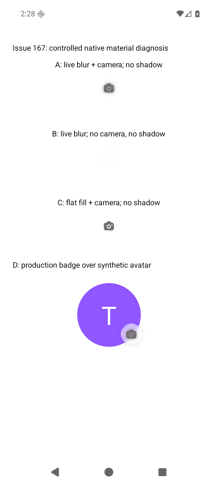

# Issue #167 — confirmed camera halo and long-term material plan

Date: 2026-10-04 (user timezone).
Status: camera implementation complete with native simulator evidence; physical-device
and release verification remain pending. See `issue-167-material/implementation.md`.
Scope: camera badge on Onboarding and Edit Profile first, followed by a focused
audit of other surfaces using real backdrop blur. Keep this separate from PR #170.

Design requirement confirmed by the user: the final Android design must match the
current iOS design. This is a rendering correction, not a redesign. Preserve the
current iOS implementation and appearance unless an internal change is essential
and passes the unchanged iOS visual baseline.

## Conclusion

The muddy camera is caused by Android's native backdrop capture including the
foreground camera SVG. It then draws a blurred camera beneath the sharp camera,
creating a dark halo and making the lens opening look filled. The effect survives
removing the badge shadow. A CSS color change would hide part of the symptom while
leaving the incorrect capture intact.

The app uses React Native styles, not a browser CSS renderer. Its shared
`FrostedSurface` dispatches to different native implementations. Sharing props
and tokens does not make those implementations equivalent. Our wrapper's comments
and the previous fix reports overstated visual parity.

This mechanism is confirmed on the isolated Android 16 emulator. It explains the
same halo visible in the reporter's Android reference, but that phone's installed
build, OS version, accessibility settings and GPU have not been inspected. A new
iOS comparison and a physical Android check are still required before release.

## Evidence and controlled experiment

The temporary diagnostic screen used the existing rebuilt debug APK, the actual
`FrostedSurface`, camera SVG, icon color and material intensity. It required no
backend, account, provider calls or production data. The diagnostic entry point
was removed and the original `index.ts` restored after capture.

Environment: `WEIF_ISSUE_167` / emulator-5556, Android 16/API 36,
720x1600px at 280dpi, headless SwiftShader rendering, three-button navigation.
Installed dependencies: Expo 54, expo-blur 15.0.7, Dimezis BlurView 2.0.6,
React Native 0.81.5; Android uses the RenderEffect path on this OS.

| Case | Treatment                                                 | Observed result                                    |
| ---- | --------------------------------------------------------- | -------------------------------------------------- |
| A    | Live blur + camera on white; no shadow                    | Dark halo around glyph; lens opening also darkened |
| B    | Live blur without camera; no shadow                       | White surface; halo absent                         |
| C    | Flat tint + same camera; no shadow                        | Sharp camera, clear opening; halo absent           |
| D    | Production `AvatarEditBadge` over synthetic purple avatar | Reproduces muddy camera and soft badge shadow      |

The unmodified capture and reproducible diagnostic source are saved in
`report/issue-167-material/`. Case C is an isolation control, not a proposed
replacement for glass over the avatar: it does not soften the avatar boundary.

Pixel check: compare A's 70x70px badge region `(325,256)-(395,326)` with C's
`(325,711)-(395,781)`. Exclude the camera using C's non-white pixel mask expanded
by two pixels. Of 3,738 remaining pixels, 598 darken by more than 10/255 under
live blur; maximum darkening is 41/255. This measures extra dark drawing outside
the foreground camera even though neither case has a shadow. It is a same-device
diagnostic measurement, not a universal cross-device tolerance.

## What the code and library do

1. `AvatarEditBadge.tsx` draws a 60%-white surface, then live blur, then the camera
   SVG as a sibling. The SVG's fill is `#707070` on both platforms.
2. `FrostedSurface.tsx` sends intensity 15 to native blur and sets Android
   `blurReductionFactor=2`. Android therefore uses a radius of 7.5; this is not
   equivalent to iOS's partially applied UIKit material effect.
3. Installed Android `ExpoBlurView.kt` captures the nearest native Screen ancestor
   or activity content root. It cannot accept a separate backdrop target through
   the installed JavaScript API.
4. Dimezis 2.0.6 `PreDrawBlurController.updateBlur()` calls
   `rootView.draw(internalCanvas)`. Its draw guard excludes BlurViews during
   capture, but not the sibling SVG. The icon therefore participates in the
   captured image. The experiment above confirms the visible result.
5. iOS uses `UIVisualEffectView` with `UIBlurEffect`, not this bitmap capture.
   Its intensity is implemented with a partially completed property animator.
6. Android's light native tint has its own color/alpha formula; iOS uses a system
   material. Flat-fill multipliers in `materials.ts` only govern the tint-only
   path and do not override the native blur path's material.
7. Shadows are also different implementations: Android `boxShadow` versus iOS
   `shadow*` props. The intended badge shadow exists on both. It contributes to
   appearance, but it is not the cause of A's camera-shaped halo.

Android below API 31 uses RenderScript instead of RenderEffect. That is a real
OS-dependent branch; its visual and performance behavior was not tested here.
Density, image content and accessibility settings also need controlled coverage.
Do not attribute this particular reproduction to OEM differences: it occurs on
a standard emulator with no OEM skin.

References:

- [Expo SDK 54 BlurView contract](https://docs.expo.dev/versions/v54.0.0/sdk/blur-view/)
- [Dimezis 2.0.6 capture implementation](https://github.com/Dimezis/BlurView/blob/version-2.0.6/library/src/main/java/eightbitlab/com/blurview/PreDrawBlurController.java)
- [React Native 0.81 boxShadow constraints](https://reactnative.dev/docs/0.81/view-style-props#boxshadow)
- [Expo SDK 55 explicit blur targets](https://docs.expo.dev/versions/v55.0.0/sdk/blur-view/)
- [Original fix claim](https://github.com/antash-mishra/who-else-is-free/issues/131#issuecomment-5488993354)
- [Subsequent material refactor](https://github.com/antash-mishra/who-else-is-free/pull/142)

## Long-term rendering contract

The app owns the badge geometry, glyph, tint and intended shadow. The blur source
contains only the avatar and page backdrop. It excludes the camera, badge tint,
badge shadow, text and sibling controls. Foreground changes must never change
background pixels outside the glyph. A transparent lens opening stays transparent.

Separate blur radius, overlay opacity/color, corner radius and shadow parameters
in the material specification. A single `intensity` must not silently mean all of
these. Platform adapters may map the specification to supported renderers, but
screen code must not contain device-specific compensation values.

The current iOS design is the acceptance reference: preserve the 40dp badge,
20dp camera, placement, icon gray, translucent material, softened avatar edge and
subtle external shadow. Do not remove the intended shadow merely because the
Android halo resembles one, or flatten the glass to make Android easier to render.

Before the replacement prototype, capture current iOS Onboarding and Edit Profile
with identical synthetic avatars/photos and page backgrounds to the Android
fixtures. Record the iOS build identifier, dimensions and settings. Freeze those
captures as the reference; the reporter's different-avatar screenshots provide
context but cannot replace matched baseline inputs. Test iOS against its own
unchanged baseline and Android against that design at normalized geometry.

Match the current iOS appearance within an explicit visual tolerance; do not promise
pixel identity between UIKit and Android effects or across densities. If the
product requires identical glass instead of native material appearance, use an
app-controlled composition only if it reproduces the frozen iOS appearance.

## Phase 1 — prove the replacement on the badge only

Recommended first direction: an app-controlled badge backdrop using the existing
Skia dependency, rather than a broad SDK upgrade just to remove this halo.
Prototype this on Android first and retain iOS's current native material. Shared
composition and tokens may dispatch to different renderers; success means Android
matches the current iOS appearance, not that both are changed to a new appearance.
Skia must draw its own source content; it does not automatically blur arbitrary
React Native siblings. Supply the avatar image/gradient, its placement and the
page backdrop explicitly. Onboarding has a page gradient; Edit Profile has a
white page. The badge crosses the avatar edge, so include both in the composition.

Draw that known backdrop, blur and clip it to the badge, apply the app-owned tint,
then draw the sharp glyph. Draw the intended shadow separately. Share existing
avatar seed/color selection and image cropping so the badge's backdrop cannot
drift from `UserAvatar`. Cache decoded image content; do not snapshot the screen
or capture the avatar every animation frame. Keep picking/removing photos and
button accessibility in the existing React Native interaction wrapper.

This is a candidate architecture, not a verified implementation. Before adopting
it, make a small prototype covering synthetic gradient avatars, no-name avatars,
portrait photos, high-contrast test images and image loading/failure. Keep the
current iOS appearance as the reference. Reject the prototype if edge alignment,
image caching, accessibility or performance requires disproportionate complexity.

Supported-native alternative: Expo SDK 55 introduces `BlurTargetView` and
`blurTarget`, allowing the backdrop to be separated from foreground controls.
Evaluate it if a compatible SDK migration is already justified, or if the scoped
composition fails its prototype gate. Audit Firebase, auth, navigation, Reanimated,
Skia, image picker, release build and OTA/runtime compatibility first. Migrate in
a separate foundation PR with rebuilt native binaries. Upgrading expo-blur alone
inside SDK 54 is not an approved shortcut. Explicit targets address capture scope;
they do not by themselves guarantee identical UIKit/Android tint or shadows.

Do not fork the native blur library, edit node_modules as a shipped fix, change
icon gray by phone model, or remove genuine avatar blur without reviewing the
resulting hard avatar boundary. Do not mix either prototype into PR #170.

Phase gate: Android matches the frozen current iOS design, iOS matches its unchanged
baseline, a sharp camera on both renderers, preserved softened avatar boundary,
no camera-shaped darkening outside the glyph with shadow disabled, correct image
alignment, working interactions, and acceptable memory/frame cost. Select the
implementation only after this evidence is recorded.

## Phase 2 — implement the shared badge with regression coverage

Implement once in the shared badge used by Onboarding and Edit Profile. Add tests
before production changes for backdrop inputs, foreground exclusion, image
loading/failure, synthetic gradient selection, clipping and unchanged accessible
interaction. Prove the regression fails against the old rendering behavior.
Native visual checks are required: a Jest mock cannot prove backdrop capture.

Keep a runnable development-only material fixture with A/B/C controls, aligned
foreground-only reference, representative backdrops and shadow on/off. It must
not require sign-in or contact a provider and must not enter production routes.
Archive failing and passing full-size captures with build/dependency metadata.

Phase gate: both screens pass, no halo or polygon, no photo-selection regression,
no persistent blank frame during image updates, and quality checks pass.

## Phase 3 — make the material abstraction honest and audit callers

Keep `FrostedSurface` as the single policy boundary. Distinguish an app-owned
translucent fill from a native backdrop effect and an explicitly composed source.
Require an explicit source for live blur wherever the chosen renderer supports
one. Mark any legacy whole-screen capture as a migration risk, not visual parity.

Audit the other real-blur callers first: Create/Edit cover chip and Cover Picker
selection badge. Text and check glyphs can participate in the same capture pattern;
their actual symptoms have not been reproduced yet. Migrate one surface per
reviewable change. Leave existing tint-only surfaces alone unless a verified
defect exists. Preserve EventCard's mask-related restriction and existing release
crash precautions. Do not replace all shadows, gradients or animations at once.

Update AGENTS.md, CLAUDE.md and the shared-components guide when the chosen
rendering contract is implemented. Replace unqualified parity claims in code
comments with the actual supported behavior and tested configurations.

## Phase 4 — enforce visual and release verification

| Configuration                   | Required coverage                                                       |
| ------------------------------- | ----------------------------------------------------------------------- |
| Android API 31+ emulator        | Foreground exclusion, image updates, portrait/landscape, two densities  |
| Older supported Android         | Legacy backend or documented deterministic fallback; performance        |
| Reporter's Android phone        | Same installed candidate, both screens, original symptom comparison     |
| iOS simulator and device        | Approved material appearance, glyph sharpness, shadow, loading          |
| Relevant accessibility settings | Increased contrast/reduced transparency; readable controls              |
| Release APK/IPA                 | Native renderer present, real photo lifecycle, no debug-only dependency |

Use identical synthetic inputs and normalized badge geometry. Compare the
foreground with the foreground-only reference, and the backdrop with a no-icon
reference, keeping the intended external shadow out of the halo measurement.
First target: on the same Android fixture the 598-pixel halo metric should fall
to the flat-control noise level, not be hidden by a looser whole-screen threshold.
Set cross-platform backdrop/shadow tolerances from approved prototype captures,
record them, and require review before changing them. Avoid exact whole-screen
pixel tests that fail on clocks, fonts or unrelated system bars.

Run focused Jest and native visual checks during implementation, then TypeScript,
lint, full Jest, changed-file formatting and diff checks. Record pre-existing
failures honestly. Re-run the material fixture on any Expo/RN/Skia/blur dependency
upgrade or change to capture/masking/shadow behavior. Test dependency updates in
rebuilt native binaries; a passing JavaScript test is insufficient.

Release only after the badge phase passes the affected-phone/iOS matrix. Keep the
previous binary and a reversible renderer change for rollback. Publish matching
before/after screenshots and the tested build identifier in #167; distinguish
verified candidate, merged code and deployed release.

## Work completed for this investigation

- Inspected issue comments, reporter's Android/iOS reference images, history,
  production badge/material code and both native library implementations.
- Ran the native control experiment and measured the camera-shaped halo.
- Re-ran `FrostedSurface.test.tsx`: 1 suite, 5 tests passed. These are prop/fill
  tests, not native visual-parity tests.
- Restored the production entry point; no production behavior, dependencies or
  SDK versions changed. Evidence and this plan are documentation artifacts.
- New physical-device and iOS live comparisons, replacement prototypes and full
  quality/release checks have not run. This investigation is not a shipped fix.
