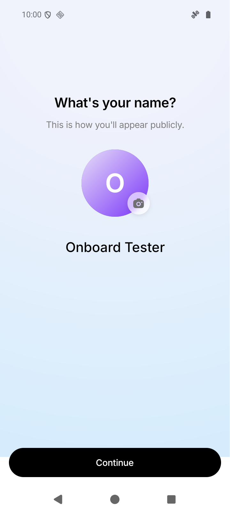
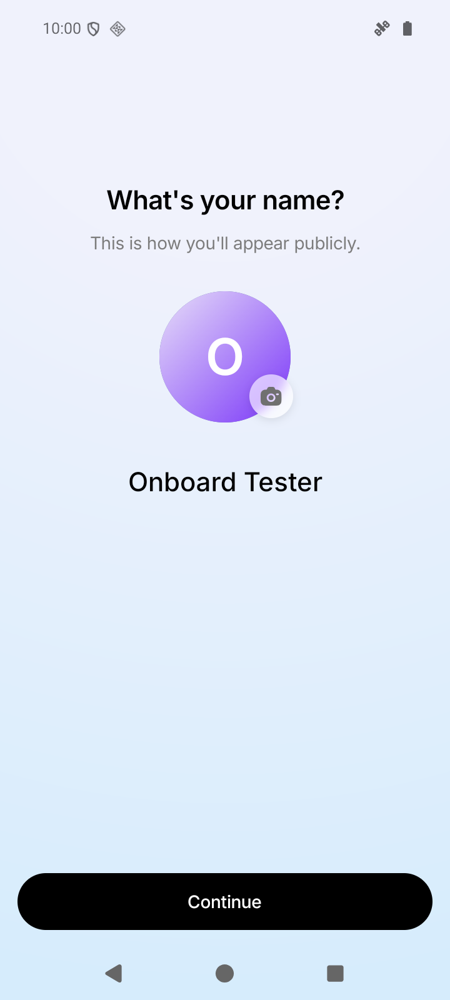
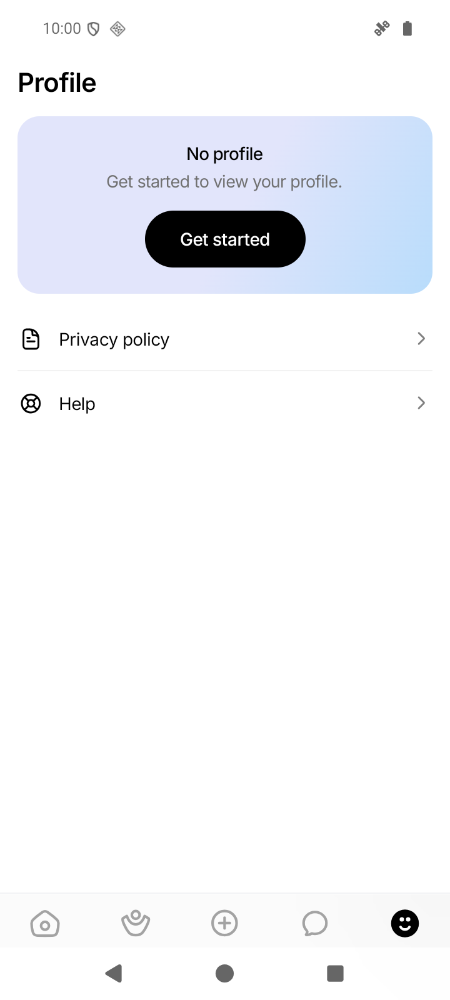

# Issue #167 — fix limited to onboarding

October 5, 2026. Signed release built before this report. Source: `2e0a38ef2526d4e7d7561e749b83fbb181e83f28`.

[Download signed test APK — 1.0.2 / build 5](https://expo.dev/artifacts/eas/YyJQze08mBOp1n500bo8keOYRMeJC_49grn8q2JI6eI.apk) · [EAS build](https://expo.dev/accounts/stoned_monk/projects/who-else-is-free/builds/6ddf0760-9317-4aa1-bd9f-4755ab259fc8) · [Visual report](issue-167-onboarding-only.html)

## 1. Onboarding — white cutoff removed

The blue background now continues below Continue and behind Android's system buttons.
The original renderer was reproduced with a controlled shorter-window measurement; both
captures use the same device, account, dimensions and simulated mismatch. The before image
shows the white boundary crossing the button. The after image uses the fixed renderer and
onboarding-only system-bar override. These are real, unedited emulator screenshots.

| Before — original renderer                                                                           | After — scoped fix                                                                                 |
| ---------------------------------------------------------------------------------------------------- | -------------------------------------------------------------------------------------------------- |
|  |  |

At the bottom-left of the system bar, the screenshot changes from RGB **255,255,255** to
**214,236,252**. Page size is 914.286dp; the controlled window is 814.286dp. This reproduces a
sizing defect consistent with the issue, rather than confirming a particular phone's firmware.
The simulation was removed before committing or building the release.

## 2. Profile — original appearance preserved

| Before — original system-bar appearance                                        | After — leaving fixed onboarding                                             |
| ------------------------------------------------------------------------------ | ---------------------------------------------------------------------------- |
|  |  |

**0 changed pixels across the full 720 × 1600 image.** The layout, background, tab bar and
system-button area match exactly. The after image was captured after completing onboarding and
signing out of the synthetic account, so it also verifies restoration on exit.

The baseline is the original appearance with Android contrast protection enabled. It is **not**
the previously shared 1.0.1 candidate, which disabled that protection globally. This candidate
restores the original appearance on other routes. Pixel equality is demonstrated for this
Profile screen under these conditions; other screens' rendering code was not changed.

## What changed

- Onboarding retains the full-page SVG background fix from `8cefd23`.
- `app.config.js` restores default navigation contrast to **true**.
- `useOnboardingNavigationBar` disables it only while Onboarding is focused; blur/unmount
  restores it. The Android `SystemNavigation` module reapplies the policy on activity resume.
- Runtime/app version **1.0.2** separates this new native module from older binaries. No iOS
  window override is performed. Safe-area spacing and other screens' styles are unchanged.

[Android documents the runtime contrast control](<https://developer.android.com/reference/android/view/Window#setNavigationBarContrastEnforced(boolean)>).

## Verification

- Full frontend suite: **131 suites / 1,509 tests passed**. Typecheck and formatting passed;
  touched lint has no errors, with only the seven existing onboarding warnings.
- Android debug build succeeded; generated native theme has contrast **true**. The same binary
  ran the original renderer for the baseline and the committed scoped renderer for the fix.
- Android 16 / `WEIF_ISSUE_167`, 720 × 1600 / 280 dpi: controlled mismatch before/after,
  all three normal onboarding steps, keyboard open/dismiss, background/resume, gesture
  navigation, activity recreation, completion to Discover and return to Profile passed.
- Switching navigation modes produced the previously observed transient development
  navigation-ref warning; background coverage remained correct. That separate warning is
  outside this fix. Profile comparison used stable three-button navigation in both captures.
- Signed release: version **1.0.2**, versionCode **5**, runtime **1.0.2**, EAS preview APK.
  APK signature v2 verified and signer matches the prior candidate. Compiled default contrast
  is **true**; native module and scoped bridge are present; bundle points to production, with
  no local test-server URL. Installed package is not debuggable.
- Installed over the earlier signed 1.0.1 APK on `WEIF_ISSUE_167_RELEASE`; guest Discover,
  Profile and Google sign-in sheet passed without Metro or dev-login controls.
- Onboarding in the signed APK awaits your account/device test. The screenshot matrix uses
  a debug binary from the same committed source, with local synthetic accounts. No physical
  phone or production profile was modified. Older Android and iOS visuals were not tested.

APK SHA-256: `51b264d9cc3571fe7f5dc2eee4bd3fb309ab4f07286faf11ea1da452ea93b7e5`.

## Test this APK

Use a new test account or an account with incomplete onboarding. Check name/gender/age in
three-button navigation, open/dismiss the name keyboard, close/reopen, then try gesture navigation.
After leaving onboarding, check Profile and the other main pages. Return PASS/FAIL, phone model,
Android/OEM version and a screenshot showing the entire bottom edge. Do not delete a real account
to reach onboarding. Keep #167 open until the affected phone passes.
