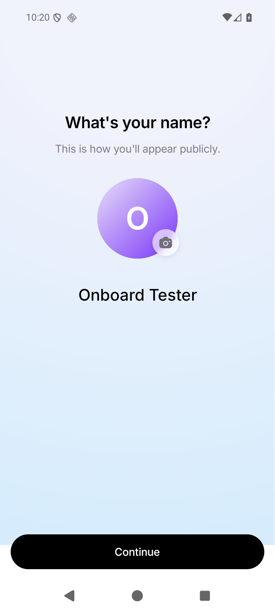
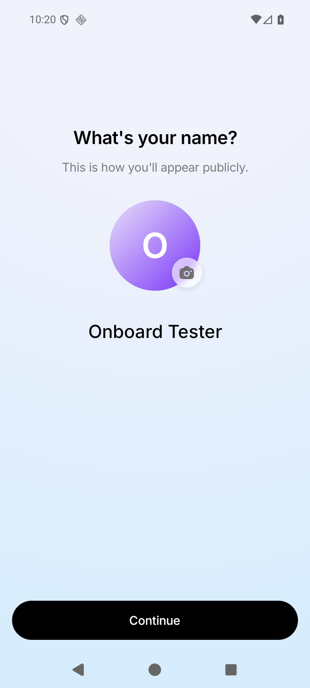

# Issue #167 follow-up: onboarding background ends inside Continue

Date: 2026-10-05. Status: implemented locally, emulator verified; affected phone and release verification pending.

## Finding

[#167](https://github.com/antash-mishra/who-else-is-free/issues/167) and
[#131](https://github.com/antash-mishra/who-else-is-free/issues/131) describe the same continuing
report. The annotated reporter screenshot has a white boundary **inside** Continue. The earlier
#170 reproduction had a pale strip starting **below** Continue, exactly at the navigation bar.
They are different failure mechanisms; the previous report tested only the latter.

The old `OnboardingScreen` sized both its SVG viewport and fill rectangle using
`useWindowDimensions().height`. That is the app window, not a measurement of the page.
[React Native documents Android window reductions for system bars](https://reactnative.dev/docs/dimensions).
The installed React Native 0.81.5 `DisplayMetricsHolder.kt` initializes window metrics from
`context.resources.displayMetrics`, while screen metrics come from `getRealMetrics`.
A full edge-to-edge page can be taller than that reported window. The SVG then stops early,
revealing the root's white `colors.background`; the independently positioned CTA crosses that edge.

The earlier Android 16 test measured equal window/page heights, so it did not exercise this case.
The reporter's model, OS, native APK and measurements have not been supplied: the mismatch is a
**reproduced sizing defect consistent with the screenshot**, not a confirmed OEM diagnosis.

There is also an independent build trap. The cached debug APK in this checkout advertised version
`1.0.1` but its compiled AppTheme still had `android:enforceNavigationBarContrast=true`, despite the
current Expo config and native XML saying false. Rebuilding changed the compiled value to false.
This proves that source config and version name alone are insufficient build evidence; it does
not establish which binary the reporter installed. [Android's contrast protection](https://developer.android.com/develop/ui/views/layout/edge-to-edge-manually)
is a native setting and cannot be replaced by a JavaScript OTA update.

## Change

- The background SVG and rectangle fill an **unpadded** page with percentage bounds immediately.
- Page `onLayout` sets the radial gradient's center/radius and tracks resizing, ignoring empty layouts.
- The pager owns the same existing safe-area/header padding. Header, CTA clearance, colors,
  opacity, validation, and navigation behavior are preserved.
- `AvatarEditBadge.pageSize` passes the same gradient geometry to Android's explicit backdrop.
  iOS's native badge material is unchanged.
- `androidNavigationBar.enforceContrast: false` remains necessary for the OS navigation region.

A first candidate kept padding on the background's parent. Native inspection exposed another gap:
Yoga percentage bounds used that parent's content box. Moving the padding to the pager removed it.
The final screenshot verifies the entire screen, not just the area near the CTA.

## Deterministic reproduction

Use a synthetic development onboarding user and a local backend; do not change real profiles.
This reproduction deliberately simulates excluded-bar window dimensions on Android 16. It does
not pretend that Android 16 spontaneously reports them or emulate a particular OEM's firmware.

1. Start `WEIF_ISSUE_167`, Android 16/API 36, 720x1600px at 280dpi, three-button navigation.
2. Build/install a native APK whose compiled contrast setting is false. Start Metro and the
   local dev-login backend. Use the existing `Dev Login (onboarding)` preset to open step 1.
3. In the **old** screen temporarily replace the window destructuring with this diagnostic:

   ```tsx
   const { width, height: reportedHeight } = useWindowDimensions();
   const screenHeight = reportedHeight - insets.top - insets.bottom;
   ```

4. Capture the native screen. Here the physical page measured **914.286dp**, while the simulated
   window was **814.286dp** (top inset 52dp, bottom 48dp). At 1.75 pixels/dp the gradient stopped
   at **y=1425px**, inside Continue's **y=1397–1488px** bounds. The OS navigation region starts at
   **y=1516px**, so disabling its scrim cannot repair the app-owned white region above it.
5. Apply the final renderer while keeping the **same** diagnostic dimensions. The entire page,
   below Continue and behind system controls, stays blue. The bottom-left sample changes from
   RGB **255,255,255** to **214,236,252**. No white edge row exists below y=1200.
6. Remove the diagnostic and verify normal navigation, all three steps, keyboard dismissal and
   cold re-entry. No injected dimensions, fixture, logging or dev route is shipped.

| Same rebuilt APK and simulated window | Before                                                          | After                                                         |
| ------------------------------------- | --------------------------------------------------------------- | ------------------------------------------------------------- |
| Onboarding step 1                     |  |  |

All PNGs are unmodified ADB screenshots with synthetic profile data.

## Native artifact check

Before testing a release, verify the actual installed/distributed artifact, not just `app.config.js`.
For this local SDK:

```sh
~/Library/Android/sdk/build-tools/36.0.0/aapt2 dump resources \
  android/app/build/outputs/apk/debug/app-debug.apk
```

In `style/AppTheme`'s `v29` entry, framework attribute `0x01010605`
(`android:enforceNavigationBarContrast`) must be **false**. This session's cached APK was true;
its replacement was false. Pulling the device's installed `base.apk` and checking that file is
stronger evidence than a tester reporting only a version name.

The rebuilt debug APK's SHA-256 is
`3cb7cd7a0221fc1311eb34f8d4eb22cafcb2df12852ec3bdc30565f43f7a2b67`.
Build command (after native generation has applied the current config):

```sh
JAVA_HOME='/Applications/Android Studio.app/Contents/jbr/Contents/Home' \
  ./android/gradlew -p android :app:assembleDebug \
  --max-workers=2 --no-parallel -PreactNativeArchitectures=arm64-v8a
```

Build succeeded in 47 seconds, 702 tasks. The initial invocation without `JAVA_HOME` failed
because the shell had no Java runtime configured. No dependency/config change was needed.

## Validation

- Regression tests failed against the original renderer, then passed with the fix.
- Focused onboarding, avatar badge and native-config tests: **4 suites, 75 tests passed**.
- Full frontend tests: **129 suites, 1,504 tests passed**.
- TypeScript passed. Touched-file lint has no errors and only existing screen warnings;
  the existing import-order warning was removed.
- Changed-file formatting and `git diff --check` passed.
- Android native artifact compiled, installed, and its contrast value was inspected.
- Android emulator screenshots and UI hierarchy verify the simulated mismatch (steps 1 and 2),
  all three normal steps in three-button and gesture navigation, keyboard dismissal and cold
  re-entry. Screenshot samples are recorded in `issue-167-window/measurements.json`.
- Switching navigation modes recreates the Android activity and resets onboarding to step 1.
  A transient development warning about the navigation ref not being initialized appeared during
  that recreation; it was dismissed before the final captures. This separate lifecycle warning
  was not investigated as part of background coverage.

## Release and affected-phone verification

Ship the JavaScript layout fix on a binary that includes the existing native contrast fix. An OTA
can apply this new layout change within a compatible runtime, but cannot retrofit the native
setting into an older binary. No production deployment or GitHub comment was made in this task.

Record the affected model, Android/OEM version, navigation mode, app version/build and update
channel. With the same candidate installed, check all onboarding steps in both navigation modes,
keyboard open/dismiss, process restart, and larger display/text settings. If it still fails,
measure page layout, reported window/screen sizes and safe-area insets on that phone. A boundary
inside the CTA points to app background coverage; a strip only in the system bar points to the
native window setting/OEM treatment. Do not add another guessed bottom margin.

Physical affected phone, older Android, iOS visuals and a signed release APK remain unverified.
