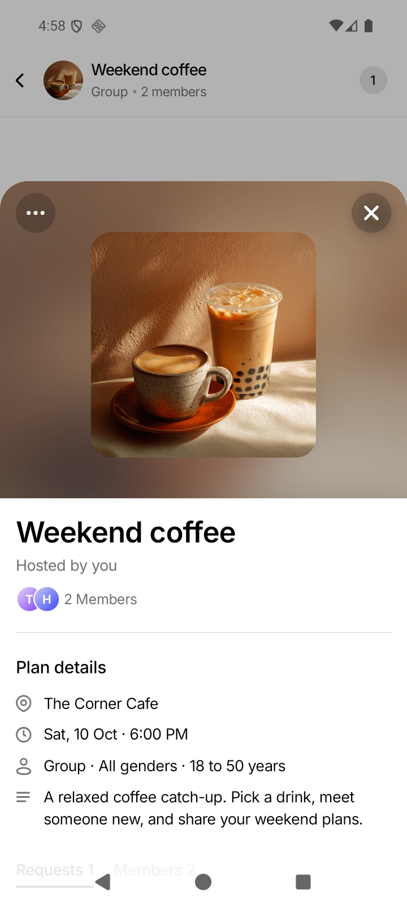
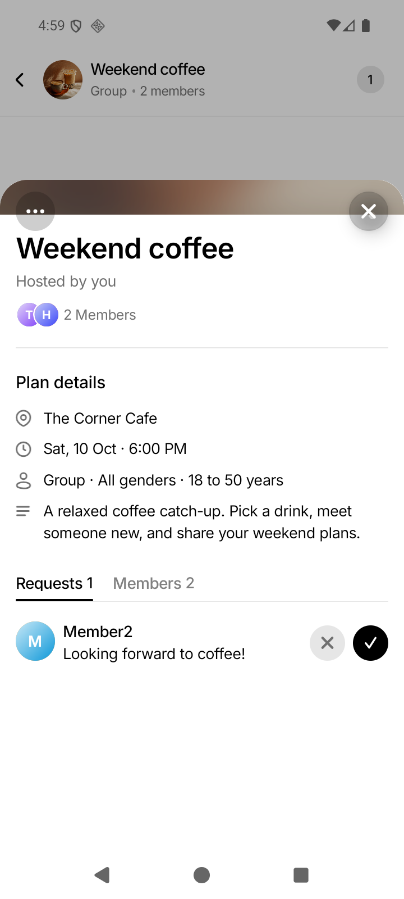
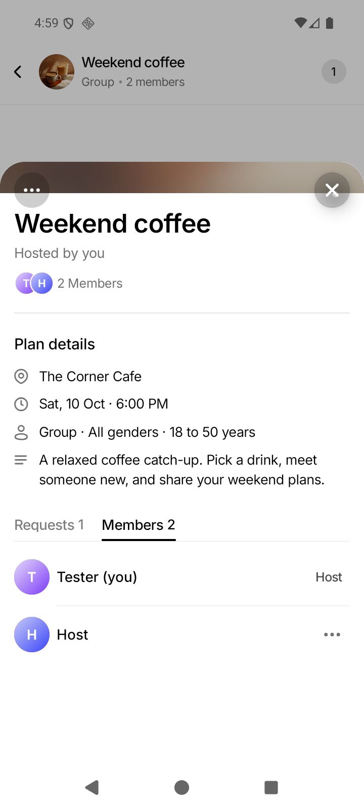
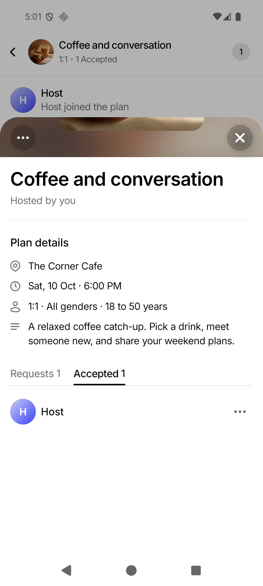
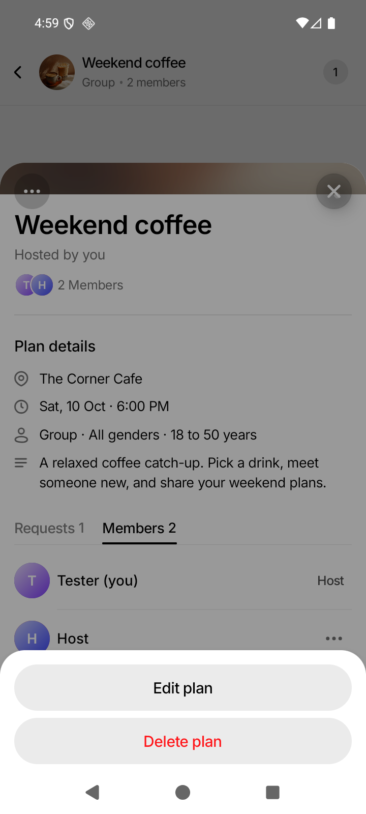
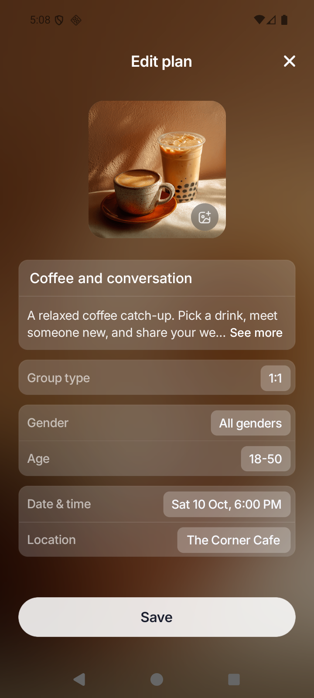
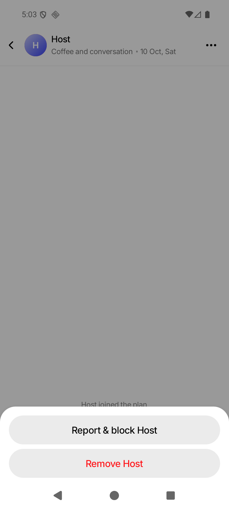

# Issue 168: Plan Details from chat

Implemented October 4, 2026 for [issue #168](https://github.com/antash-mishra/who-else-is-free/issues/168), on `codex/issue-168-chat-plan-details`, based on `master` at `4eee544`.

Chat headers now open the normal interactive Plan Details content inside the existing bottom sheet. The bottom CTA and its reserved space are suppressed independently of `readOnly`. Group hosts see Requests/Members; 1:1 hosts see Requests/Accepted, without duplicate sections. The member summary, description, permission-based plan actions, and existing request refresh behavior are retained. More actions is on the left; Close remains on the right. A 1:1 host's report/block/remove actions remain available from a separate header button. Historical and explicitly read-only views retain their previous behavior.

## Validation

- Before implementation, four focused regression tests failed on the missing host tabs, duplicate Accepted section, visible CTA, and 1:1 header opening person actions instead of plan details.
- Focused screen tests: three suites / 154 tests passed before the additional group/hub navigation regressions were added.
- Full frontend Jest: 126 suites / 1,468 tests passed, including the additional navigation regressions and existing past-plan/read-only and moderation tests.
- The Android focus regression first failed with a visible modal over the editor. SheetRoute now hides its native modal when unfocused and restores it on return; both platform tests pass.
- TypeScript (`tsc --noEmit`): passed.
- ESLint: passed with 0 errors and 721 warnings. An initial run included an unused ignored local Metro config; it was removed before the successful run.
- Touched-file Prettier and `git diff --check`: passed.
- Full-repository Prettier: failed on 216 files; the repository has an existing formatting baseline. No broad formatting rewrite was applied.
- Local QA backend: compiled with `go build`; backend tests were not run because no backend code changed.

## Android visual verification

Verified on `WEIF_ISSUE_167` / `emulator-5554`, Android 16, 720 × 1600, using the installed `com.whoelseisfree.app` development client. Metro served this branch on port 8169 and an isolated local API served synthetic data on port 8168. Tokens, the disposable database, raw logs, and setup script remain ignored under `.data/issue-168/`. The existing checkout and other running services were preserved.

Verified group and 1:1 header entry, vertical scrolling, Requests/Members and Requests/Accepted tabs, absence of bottom CTAs, nested plan-action menus, the dedicated person-action button, and Close/system-back returning to the chat or hub. Opening Edit plan was additionally verified after fixing native modal focus; Back restored the details sheet. Tapping an Accepted guest opened their private chat without the sheet blocking it, and Back returned to the 1:1 hub. Videos were captured from the running app and inspected as filmstrips. These are synthetic QA plans and users, not production conversations.

- [Group sheet flow (MP4)](./screenshots/issue-168/group-flow-android.mp4)
- [1:1 hub and private chat sheet flow (MP4)](./screenshots/issue-168/single-flow-android.mp4)

## Remaining verification

Native iOS, physical Android, release builds, and deployment were not verified. The installed Android client emitted a pre-existing missing ToastBlur native-view warning, so action-toast appearance was not claimed as verified. No native files or backend behavior were changed. This evidence demonstrates the branch in an Android development client; it is not a production-release claim.
