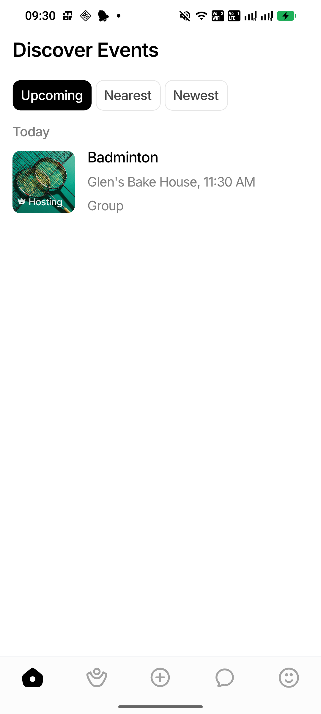
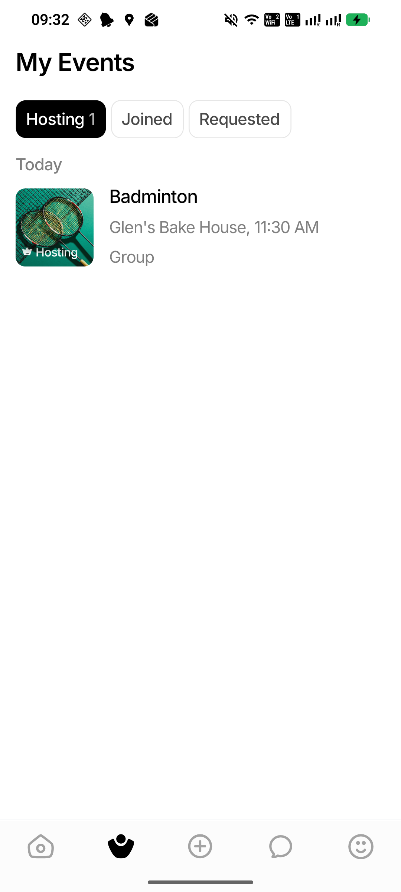
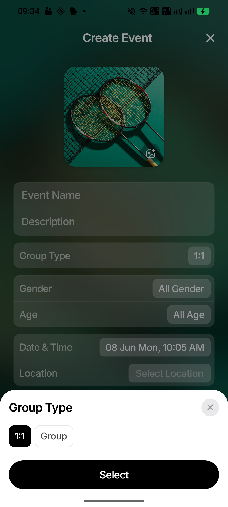
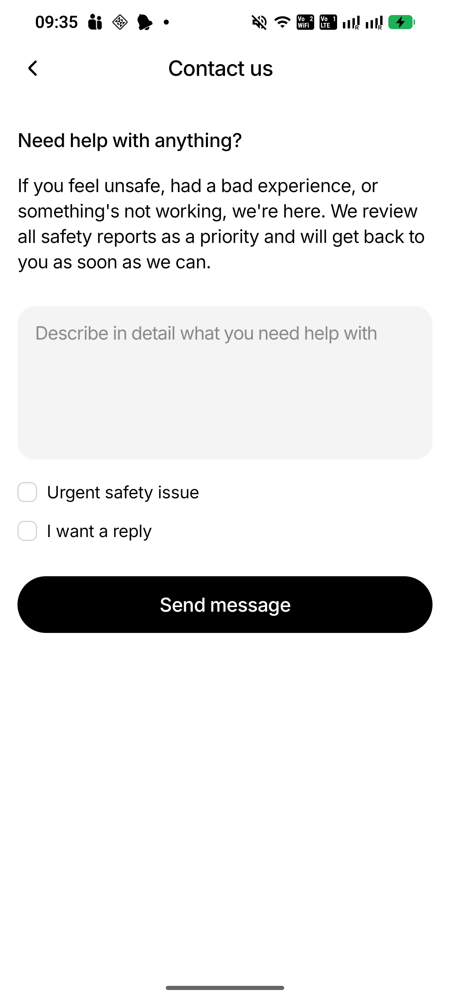

# Shared Components And Refactor Guide

Date: 2026-06-08

This guide documents the shared UI, shared styling, and structural refactors added across the recent refactor phases after the green test baseline commit.

Reviewed commit range:

- `7bb3477 refactor: add shared primitives and semantic haptics`
- `888918d refactor: unify sheet and overlay foundations`
- `722e9bf refactor: share event list foundations`
- `45e145e refactor: extract event details overlay routes`
- `dc8bc62 refactor: extract create event form mapping`
- `f63f792 refactor: share API request timeout helpers`
- `7e4a6ec refactor: tighten navigation route typing`
- `39fe7d4 refactor: tokenize navigation colors`

## Review Status

The refactor is in a good state for the next phase of work.

Validation run:

```sh
npm run typecheck
npm run lint -- --quiet
npm test -- --runInBand --silent
cd server && go test ./...
```

Result:

- TypeScript passed.
- ESLint passed with no errors in quiet mode.
- Frontend Jest passed: 61 suites, 1099 tests.
- Backend Go tests passed.

No blocking code-review findings were found in the reviewed phase commits. There is still normal follow-up cleanup to do: some screen-local styling remains, but the main repeated interaction and layout surfaces now have shared owners.

## Screenshot References

Screenshots were captured from the connected Android emulator with mobile-mcp.

| Screenshot | What It Shows |
| --- | --- |
|  | `SegmentedControl` -> `AppTabs`, `EventListPage`, `EventSectionList`, shared event card rows |
|  | Shared event-list sections reused in My Events with count tabs |
|  | `CreateEventBottomSheet` using the shared `BottomSheet` foundation |
|  | `HelpForm`, `TextField`, `CheckboxRow`, and `AppButton` |
|  | `EventActionOverlay`, `BottomSheetModal`, and shared confirm action styling |

## New Shared UI Primitives

### `AppButton`

File: `src/components/ui/AppButton.tsx`

Use for primary, secondary, destructive, and ghost buttons.

Before:

- Screens and components created local `Pressable`, `TouchableOpacity`, or `ScalePressable` buttons.
- Button height, radius, opacity, loading indicators, haptics, and disabled styles were repeated.
- Direct haptic calls often lived in the screen.

Now:

- Use `AppButton` for common CTA buttons.
- `AppButton` owns disabled state, loading state, haptic feedback, variants, text style, and accessibility state.
- It uses `componentTokens.button`, `colors.primaryButtonBackground`, `colors.secondaryButtonBackground`, and semantic haptic props.

Current usage:

- `src/components/EmptyState.tsx`
- `src/components/SignInButtons.tsx`
- `src/components/help/HelpForm.tsx`

Example:

```tsx
<AppButton
  label="Send message"
  onPress={handleSubmit}
  loading={isSubmitting}
  disabled={isSubmitting}
  haptic="submit"
/>
```

### `AppTabs`

File: `src/components/ui/AppTabs.tsx`

Use for repeated tab and segmented-control UI.

Before:

- `SegmentedControl` had its own animated colors, spacing, and press behavior.
- Event Details also had separate tab/underline implementations inline.

Now:

- `AppTabs` owns pill and underline tab variants.
- `SegmentedControl` is a thin wrapper around `AppTabs` with `variant="pill"`.
- Tab animation, selected state, count labels, test IDs, and selection haptics are centralized.

Current usage:

- `src/components/SegmentedControl.tsx`
- Discover Events and My Events through `SegmentedControl`

Example:

```tsx
<AppTabs
  options={[
    { label: 'Hosting', value: 'hosting', count: 1 },
    { label: 'Joined', value: 'joined' },
  ]}
  value={selectedTab}
  onChange={setSelectedTab}
/>
```

### `AppText`

File: `src/components/ui/AppText.tsx`

Use for simple shared typography variants.

Before:

- Screens repeated font family, line height, letter spacing, muted/error colors, and title/body sizes.

Now:

- `AppText` provides `title`, `subtitle`, `body`, `caption`, `button`, and `error` variants.
- It is intentionally small so screens can still apply layout-specific style overrides.

Current usage:

- `EmptyState`
- `HelpContactScreen`
- `HelpFeedbackScreen`
- `HelpFAQScreen`
- Shared UI primitives

### `TextField`

File: `src/components/ui/TextField.tsx`

Use for common single-line and multiline text inputs.

Before:

- Help, profile, event, and overlay forms duplicated input backgrounds, radius, placeholder color, padding, and error text.

Now:

- `TextField` owns input surface color, placeholder color, single-line vs multiline shape, and optional error text.
- `HelpForm` uses it for message and email fields.

Example:

```tsx
<TextField
  accessibilityLabel="Help message"
  multiline
  value={message}
  onChangeText={setMessage}
  placeholder="Describe in detail what you need help with"
/>
```

### `CheckboxRow`

File: `src/components/ui/CheckboxRow.tsx`

Use for checkbox-style rows.

Before:

- Help form checkbox rows had local checkbox boxes, labels, checked state styling, and press behavior.

Now:

- `CheckboxRow` owns checkbox visual state, row layout, checkbox accessibility role, selected state, disabled state, and selection haptic.

Current usage:

- `src/components/help/HelpForm.tsx`

### `IconButton`

File: `src/components/ui/IconButton.tsx`

Use for close buttons, back/header icon actions, and small icon-only buttons.

Before:

- Header and sheet close buttons repeated hit slop, background, icon sizing, and accessibility wiring.

Now:

- `IconButton` wraps `ScalePressable` with standard sizes, hit slop, variants, haptics, disabled state, and accessibility label.

Current usage:

- `ScreenHeader`
- `SheetHeader`

### `ListSeparator` And `SectionHeaderText`

Files:

- `src/components/ui/ListSeparator.tsx`
- `src/components/ui/SectionHeaderText.tsx`

Use for repeated simple list dividers and section text styles.

Before:

- Screens repeated `StyleSheet.hairlineWidth`, border colors, and medium section labels.

Now:

- Dividers and section labels have small shared primitives that use theme tokens.

Current usage:

- `HelpScreen`
- Available for new list and settings screens.

## Shared Press And Haptics

### `ScalePressable`

File: `src/components/ScalePressable.tsx`

Before:

- Many call sites handled press scale and `expo-haptics` directly.
- Interactions that looked similar could feel different.

Now:

- `ScalePressable` accepts a semantic `haptic` prop.
- It still owns the press scale animation and optional delayed press for event rows.
- Shared components such as `AppButton`, `IconButton`, `CheckboxRow`, `EventSectionList`, and screen menu rows build on it.

Example:

```tsx
<ScalePressable haptic="light" onPress={openMenu}>
  <Text>Open menu</Text>
</ScalePressable>
```

### Semantic Haptics Service

File: `src/services/haptics.ts`

Before:

- Screens imported `expo-haptics` directly.
- Some interactions used impact feedback, others selection feedback, with no shared meaning.

Now:

- Code calls `triggerHaptic('light')`, `triggerHaptic('selection')`, `triggerHaptic('submit')`, `triggerHaptic('destructive')`, etc.
- The service safely catches haptic errors so feedback never blocks the interaction.
- `expo-haptics` is isolated to the service.

Current usage:

- `ScalePressable`
- `AnimatedPager`
- Create Event
- Event Details
- Chat screens
- Profile and Help flows
- Sheet action lists

## Shared Sheet And Overlay Foundations

### `BottomSheet`

File: `src/components/sheets/BottomSheet.tsx`

Use for all bottom-sheet foundations.

Before:

- `BottomSheetModal` and `CreateEventBottomSheet` each owned animation, backdrop, keyboard avoidance, radii, shadows, padding, and mounting behavior.
- Event action overlays carried separate prompt and sheet styles.

Now:

- `BottomSheet` owns modal vs inline presentation, keyboard avoidance, snap height, backdrop, open/close animation, max height, safe area, and shared sheet styling.
- Wrappers keep old public APIs stable.

Current wrappers:

- `BottomSheetModal`
- `CreateEventBottomSheet`

Example:

```tsx
<BottomSheetModal visible={visible} onClose={onClose} title="Group Type">
  {children}
</BottomSheetModal>
```

### `SheetHeader`

File: `src/components/sheets/SheetHeader.tsx`

Use for sheet titles and close buttons.

Before:

- Sheet headers duplicated text style and close-button styling.

Now:

- `SheetHeader` uses `IconButton`, sheet title typography, and shared close icon treatment.

### `SheetActionList`

File: `src/components/sheets/SheetActionList.tsx`

Use for vertical action lists inside sheets.

Before:

- Manage menus, pending-request menus, and account actions repeated row height, pill radius, destructive labels, loading label text, and haptic behavior.

Now:

- `SheetActionList` owns disabled/loading/destructive states and light/destructive haptics.

Current usage:

- `ManageEventMenu`
- `PendingRequestMenu`
- generic `ActionMenu`

### `EventActionOverlay` Prompt Split

Files:

- `src/components/EventActionOverlay.tsx`
- `src/components/EventActionOverlay.prompts.tsx`
- `src/components/EventActionOverlay.styles.ts`

Before:

- `EventActionOverlay` contained multiple prompt variants and action-menu logic in one large component.

Now:

- The top-level overlay just chooses a prompt variant and renders it in `BottomSheetModal`.
- Prompt bodies live in `EventActionOverlay.prompts.tsx`.
- Menu-style prompts use `SheetActionList`.

Current prompt types:

- `invite`
- `manage`
- `confirm`
- `result`
- `pendingRequest`
- `report`
- `menu`
- `viewIntro`

## Shared Event List Foundations

### `EventListPage`

File: `src/components/events/EventListPage.tsx`

Use as the screen-level wrapper around an event section list.

Before:

- Discover, My Events, and Past Events each repeated list wrapper structure and padding coordination.

Now:

- `EventListPage` wraps `EventSectionList` and keeps each screen focused on data and state.

### `EventSectionList`

File: `src/components/events/EventSectionList.tsx`

Use for grouped event card lists.

Before:

- Home, My Events, and Past Events each built their own event list rows, section headers, item separators, footer spacing, refresh control, and empty states.

Now:

- `EventSectionList` owns section rendering, event row press behavior, haptics, separators, padding, empty state placement, and pull-to-refresh.
- Screens pass sections and callbacks.

Current usage:

- `HomeScreen`
- `MyEventsScreen`
- `PastEventsScreen`

### Event List Mappers

File: `src/components/events/eventListSections.ts`

Before:

- Screens repeated event-to-card mapping, badge label selection, date grouping, and date sorting.

Now:

- Shared helpers handle the repeated mapping:
  - `toEventCardItem`
  - `buildEventSections`
  - `buildSingleEventSection`
  - `buildEventItemSections`
  - `sortEventsByCreatedAtDesc`

Example:

```tsx
const hostingSections = useMemo(
  () => buildEventSections(userEvents, () => 'Hosting'),
  [userEvents],
);
```

## Shared Help Form

### `HelpForm`

File: `src/components/help/HelpForm.tsx`

Before:

- Contact and feedback forms repeated multiline input, optional reply email input, checkbox rows, submit button, loading state, and form spacing.

Now:

- `HelpForm` composes `TextField`, `CheckboxRow`, and `AppButton`.
- `HelpContactScreen` owns contact-specific validation and payload.
- `HelpFeedbackScreen` owns feedback-specific validation and payload.

Current usage:

- `HelpContactScreen`
- `HelpFeedbackScreen`

## Event Details Overlay Extraction

### `EventDetailsOverlayRoutes`

File: `src/screens/event-details/EventDetailsOverlayRoutes.tsx`

Before:

- `EventDetailsScreen` directly rendered every invite, manage, delete, pending request, report, leave, member-menu, remove-member, badge, and sign-in overlay inline.

Now:

- `EventDetailsScreen` owns state and handlers.
- `EventDetailsOverlayRoutes` owns overlay composition.
- The main screen JSX is easier to scan and future overlay changes have a smaller surface.

Use this pattern for future extractions:

- Keep state and business handlers in the screen until a hook extraction is clearly useful.
- Move repeated overlay composition into a route/component file.
- Keep route params typed in `src/navigation/types.ts`.

## Create Event Form Mapping

### `createEventForm`

File: `src/screens/create-event/createEventForm.ts`

Before:

- Create/edit screen logic directly normalized title, description, date, time, location, age range, cover, guest draft, and update payload values.

Now:

- Form state and submit payload mapping are isolated and tested.
- `CreateEventScreen` handles UI and orchestration.
- `createEventForm.ts` handles mapping:
  - `createEmptyFormState`
  - `createFormStateFromEvent`
  - `normalizeCreateEventForm`
  - `buildCreateEventPayload`
  - `buildUpdateEventPayload`
  - `buildGuestEventDraft`

This makes future Create/Edit UI changes safer because payload behavior has a focused test file.

## Shared API Timeout Helpers

### `createRequestTimeout` And `isAbortError`

File: `src/api/request.ts`

Before:

- Contexts created `AbortController` timeouts inline.
- Timeout cleanup and abort error checks were repeated.

Now:

- `createRequestTimeout(timeoutMs)` returns `{ signal, clear }`.
- `isAbortError(err)` centralizes abort detection.

Current usage:

- `ChatContext.refreshConversations`
- `ChatContext.refreshJoinRequests`
- `EventsContext.refreshEvents`
- `EventsContext.refreshRequestedEvents`

## Navigation Typing And Tokenized Navigation Colors

Files:

- `src/navigation/types.ts`
- `src/context/pushRouting.ts`
- `src/context/PushContext.tsx`
- `src/navigation/AppNavigator.tsx`
- `src/theme/colors.ts`

Before:

- Some navigation paths relied on looser typing and local color literals.
- Push routing had less explicit route params.

Now:

- `RootStackParamList` includes typed params for `EventDetailsOverlay`, `PendingRequests`, `JoinRequests`, and other routes.
- `pushRouting.ts` uses typed navigation contracts.
- Navigation background, sheet backdrop, tab frosted overlay, unread dot, splash background, and EventCreated background colors live in `colors`.

## Shared Styling And Tokens

Shared styling in React Native now means:

- theme tokens in `src/theme`
- shared primitive components in `src/components/ui`
- sheet foundations in `src/components/sheets`
- shared event-list composition in `src/components/events`

Important token files:

- `src/theme/colors.ts`
- `src/theme/components.ts`
- `src/theme/layout.ts`
- `src/theme/radii.ts`
- `src/theme/shadows.ts`
- `src/theme/spacing.ts`
- `src/theme/typography.ts`
- `src/theme/springs.ts`

Use tokens instead of adding new raw values when a value is repeated across screens.

## What To Use For New Work

| Need | Use |
| --- | --- |
| Primary/secondary/destructive CTA | `AppButton` |
| Icon-only close/back/action button | `IconButton` |
| Common press scale/haptic wrapper | `ScalePressable` |
| Single-line or multiline input | `TextField` |
| Checkbox row | `CheckboxRow` |
| Tabs/segmented controls | `AppTabs` or `SegmentedControl` |
| Simple shared text variant | `AppText` |
| List divider | `ListSeparator` |
| Bottom sheet | `BottomSheetModal` or `CreateEventBottomSheet` wrapper |
| Sheet action menu | `SheetActionList` |
| Event card sections | `EventListPage` / `EventSectionList` |
| Event section data | `buildEventSections` / `buildEventItemSections` |
| Haptic feedback | `triggerHaptic` or `haptic` prop |
| Fetch timeout | `createRequestTimeout` |

## Before And Now Summary

### Buttons

Before:

- Local `Pressable` or `TouchableOpacity`
- Local loading indicator
- Local disabled opacity
- Local haptic call
- Local height/radius/color

Now:

- `AppButton` or `ScalePressable`
- Shared tokens and semantic haptics

### Inputs

Before:

- Each form owned input background, padding, placeholder color, multiline behavior, and error text.

Now:

- `TextField` owns common input visuals.
- Form components own validation and payload behavior.

### Tabs

Before:

- Segmented controls and event-detail tabs used separate implementations.

Now:

- `AppTabs` owns repeated tab motion and selected states.
- `SegmentedControl` wraps `AppTabs`.

### Sheets

Before:

- Modal sheets, Create Event sheets, and action overlays had separate sheet foundations.

Now:

- `BottomSheet` owns the common mechanics.
- Wrappers preserve current public APIs.

### Event Lists

Before:

- Discover, My Events, and Past Events repeated section list scaffolding and event-card mapping.

Now:

- Screens build sections with helpers and render through `EventSectionList`.

### Haptics

Before:

- Direct `expo-haptics` calls spread across screens.

Now:

- Only `src/services/haptics.ts` imports `expo-haptics`.
- Callers use semantic feedback names.

## Remaining Follow-Up

- Continue replacing screen-local one-off buttons with `AppButton` where the visuals match.
- Continue replacing repeated text inputs with `TextField`.
- Consider moving more Event Details tab UI to `AppTabs` once behavior is stable.
- Keep avoiding direct `expo-haptics` imports outside `src/services/haptics.ts`.
- Keep `AGENTS.md` updated when new primitives or validation rules are added.
